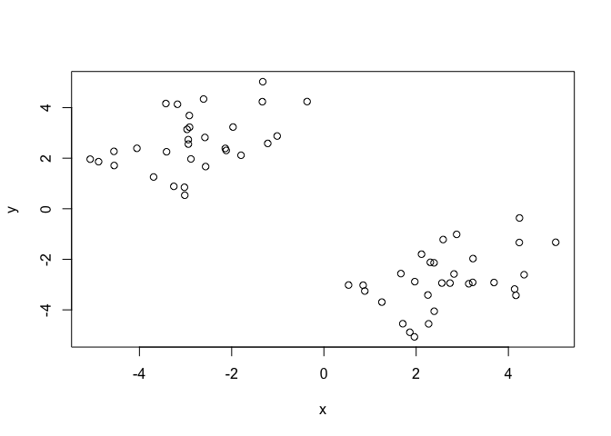

Class 7: Machine Learning 1
================
Elena

- <a href="#useful-functions" id="toc-useful-functions">Useful
  Functions</a>
- <a href="#k-means-clustering" id="toc-k-means-clustering">K-means
  Clustering</a>
  - <a href="#q.-what-component-of-your-result-object-details"
    id="toc-q.-what-component-of-your-result-object-details">Q. What
    ‘component’ of your result object details</a>
  - <a
    href="#q.-plot-x-coloured-by-the-kmeans-cluster-assignment-and-add-cluster-centers-as-blue-points"
    id="toc-q.-plot-x-coloured-by-the-kmeans-cluster-assignment-and-add-cluster-centers-as-blue-points">Q.
    Plot x coloured by the kmeans cluster assignment and add cluster centers
    as blue points</a>
- <a href="#hierarchical-clustering"
  id="toc-hierarchical-clustering">Hierarchical Clustering</a>
- <a href="#principal-component-analysis"
  id="toc-principal-component-analysis">Principal Component Analysis</a>
  - <a
    href="#q1.-how-many-rows-and-columns-are-in-your-new-data-frame-named-x-what-r-functions-could-you-use-to-answer-this-questions"
    id="toc-q1.-how-many-rows-and-columns-are-in-your-new-data-frame-named-x-what-r-functions-could-you-use-to-answer-this-questions">Q1.
    How many rows and columns are in your new data frame named x? What R
    functions could you use to answer this questions?</a>
  - <a
    href="#q2.-which-approach-to-solving-the-row-names-problem-mentioned-above-do-you-prefer-and-why-is-one-approach-more-robust-than-another-under-certain-circumstances"
    id="toc-q2.-which-approach-to-solving-the-row-names-problem-mentioned-above-do-you-prefer-and-why-is-one-approach-more-robust-than-another-under-certain-circumstances">Q2.
    Which approach to solving the ‘row-names problem’ mentioned above do you
    prefer and why? Is one approach more robust than another under certain
    circumstances?</a>
  - <a
    href="#q3.-changing-what-optional-argument-in-the-above-barplot-function-results-in-the-following-plot"
    id="toc-q3.-changing-what-optional-argument-in-the-above-barplot-function-results-in-the-following-plot">Q3.
    Changing what optional argument in the above barplot() function results
    in the following plot?</a>
  - <a
    href="#q5.-generating-all-pairwise-plots-may-help-somewhat.-can-you-make-sense-of-the-following-code-and-resulting-figure-what-does-it-mean-if-a-given-point-lies-on-the-diagonal-for-a-given-plot"
    id="toc-q5.-generating-all-pairwise-plots-may-help-somewhat.-can-you-make-sense-of-the-following-code-and-resulting-figure-what-does-it-mean-if-a-given-point-lies-on-the-diagonal-for-a-given-plot">Q5.
    Generating all pairwise plots may help somewhat. Can you make sense of
    the following code and resulting figure? What does it mean if a given
    point lies on the diagonal for a given plot?</a>
  - <a
    href="#q6.-what-is-the-main-differences-between-n.-ireland-and-the-other-countries-of-the-uk-in-terms-of-this-data-set"
    id="toc-q6.-what-is-the-main-differences-between-n.-ireland-and-the-other-countries-of-the-uk-in-terms-of-this-data-set">Q6.
    What is the main differences between N. Ireland and the other countries
    of the UK in terms of this data-set?</a>
  - <a href="#pca-to-the-rescue" id="toc-pca-to-the-rescue">PCA to the
    rescue</a>
  - <a href="#variable-loadings" id="toc-variable-loadings">Variable
    Loadings</a>

# Useful Functions

- `rnorm()` gives set of numbers that are normally distributed

- `c()` makes vector

- `cbind()` combines columns

- `kmeans()` base R function for clustering; arguments include input
  data and centres

# K-means Clustering

Let’s make up some data to cluster.

``` r
tmp <- c(rnorm(30,-3), rnorm(30,+3))
x <- cbind(x=tmp, y=rev(tmp))
plot(x)
```



The function to do k-means clustering in base R is called `kmeans()`. We
give this our input data for clustering and the number of clusters we
want `centers`.

``` r
km <- kmeans(x, centers = 2, nstart=20)
km
```

    K-means clustering with 2 clusters of sizes 30, 30

    Cluster means:
              x         y
    1 -2.823785  2.647803
    2  2.647803 -2.823785

    Clustering vector:
     [1] 1 1 1 1 1 1 1 1 1 1 1 1 1 1 1 1 1 1 1 1 1 1 1 1 1 1 1 1 1 1 2 2 2 2 2 2 2 2
    [39] 2 2 2 2 2 2 2 2 2 2 2 2 2 2 2 2 2 2 2 2 2 2

    Within cluster sum of squares by cluster:
    [1] 75.10679 75.10679
     (between_SS / total_SS =  85.7 %)

    Available components:

    [1] "cluster"      "centers"      "totss"        "withinss"     "tot.withinss"
    [6] "betweenss"    "size"         "iter"         "ifault"      

## Q. What ‘component’ of your result object details

- cluster size?

``` r
km$size
```

    [1] 30 30

- cluster assignment?

``` r
km$cluster
```

     [1] 1 1 1 1 1 1 1 1 1 1 1 1 1 1 1 1 1 1 1 1 1 1 1 1 1 1 1 1 1 1 2 2 2 2 2 2 2 2
    [39] 2 2 2 2 2 2 2 2 2 2 2 2 2 2 2 2 2 2 2 2 2 2

- cluster center?

``` r
km$centers
```

              x         y
    1 -2.823785  2.647803
    2  2.647803 -2.823785

## Q. Plot x coloured by the kmeans cluster assignment and add cluster centers as blue points

``` r
plot(x, col=km$cluster)
points(km$centers,col="blue", pch=15, cex=1.5)
```


# Hierarchical Clustering

The `hclust()` function performs hierarchival clustering. The big
advantace here is I don’t need to tell it “k” the number of clusters…

To run `hclust()`, I need to provide a distance matrix (`dist()`) as
input (not the original data!)

``` r
hc <- hclust(dist(x))
hc
```


    Call:
    hclust(d = dist(x))

    Cluster method   : complete 
    Distance         : euclidean 
    Number of objects: 60 

``` r
plot(hc)
```


To get my “main” result (cluster membership) I want to “cut” this tree
to yield “branches” whose leaves are the members of the cluster.

``` r
cutree(hc, h=8)
```

     [1] 1 1 1 1 1 1 1 1 1 1 1 1 1 1 1 1 1 1 1 1 1 1 1 1 1 1 1 1 1 1 2 2 2 2 2 2 2 2
    [39] 2 2 2 2 2 2 2 2 2 2 2 2 2 2 2 2 2 2 2 2 2 2

More often, we will use `cutree()` with k=2; for example:

``` r
grps <- cutree(hc,k=2)
```

Plot of data clustered by groups:

``` r
plot(x, col=grps)
```


# Principal Component Analysis

## Q1. How many rows and columns are in your new data frame named x? What R functions could you use to answer this questions?

Using `dim()` or `nrow()` and `ncol()`; 17 rows and 5 columns.

``` r
#Import Data
url <- "https://tinyurl.com/UK-foods"
x <- read.csv(url)
dim(x)
```

    [1] 17  5

``` r
#Preview the first 6 rows
head(x)
```

                   X England Wales Scotland N.Ireland
    1         Cheese     105   103      103        66
    2  Carcass_meat      245   227      242       267
    3    Other_meat      685   803      750       586
    4           Fish     147   160      122        93
    5 Fats_and_oils      193   235      184       209
    6         Sugars     156   175      147       139

``` r
#Fixing row names
rownames(x) <- x[,1]
x <- x[,-1]
head(x)
```

                   England Wales Scotland N.Ireland
    Cheese             105   103      103        66
    Carcass_meat       245   227      242       267
    Other_meat         685   803      750       586
    Fish               147   160      122        93
    Fats_and_oils      193   235      184       209
    Sugars             156   175      147       139

``` r
#Alternative approach
x <- read.csv(url, row.names=1)
head(x)
```

                   England Wales Scotland N.Ireland
    Cheese             105   103      103        66
    Carcass_meat       245   227      242       267
    Other_meat         685   803      750       586
    Fish               147   160      122        93
    Fats_and_oils      193   235      184       209
    Sugars             156   175      147       139

## Q2. Which approach to solving the ‘row-names problem’ mentioned above do you prefer and why? Is one approach more robust than another under certain circumstances?

The second approach because we don’t want to accidentally keep deleting
the row names, which can happen with the first approach.

## Q3. Changing what optional argument in the above barplot() function results in the following plot?

`beside=FALSE`.

``` r
barplot(as.matrix(x), beside=T, col=rainbow(nrow(x)))
```


``` r
?barplot
```

``` r
barplot(as.matrix(x), beside=F, col=rainbow(nrow(x)))
```


## Q5. Generating all pairwise plots may help somewhat. Can you make sense of the following code and resulting figure? What does it mean if a given point lies on the diagonal for a given plot?

Plot is all possible pairwise plots, and each one corresponds to
comparison between two countries. Each point corresponds to the food
group (coloured by `col=rainbow(10)` with the shape `pch=16`). A
straight line would indicate that the two countries have the same values
for each food group.

``` r
pairs(x, col=rainbow(10), pch=16)
```


## Q6. What is the main differences between N. Ireland and the other countries of the UK in terms of this data-set?

They eat more of one food group, as indicated by the deep blue dot.

## PCA to the rescue

The main function in base R to do PCR is called `prcomp()`. One issue
with the function is that it expects the transpose of our data as input
i.e., it wants the countries as the rows and the food groups as the
columns.

``` r
pca <- prcomp(t(x))
summary(pca)
```

    Importance of components:
                                PC1      PC2      PC3       PC4
    Standard deviation     324.1502 212.7478 73.87622 4.189e-14
    Proportion of Variance   0.6744   0.2905  0.03503 0.000e+00
    Cumulative Proportion    0.6744   0.9650  1.00000 1.000e+00

The object returned by `prcomp()` has our results that include a \$x
component. This is our “scores” along the PCs (i.e., the plot of our
data along the new PC axis).

``` r
#Make PCA plot
plot(pca$x[,1],pca$x[,2],
     xlab="PC1", ylab="PC2",
     col=c("orange","red","blue","darkgreen"),
     pch=16)
text(pca$x[,1], pca$x[,2], colnames(x))
```


## Variable Loadings

``` r
#For PC1
par(mar=c(10, 3, 0.35, 0))
barplot( pca$rotation[,1], las=2 )
```


