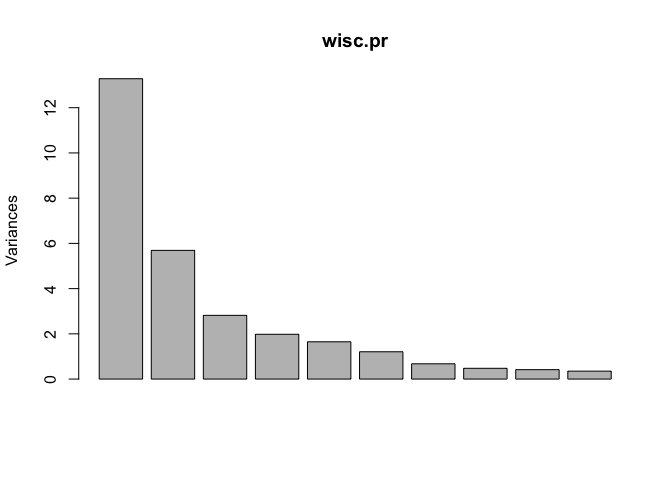

Class 8: Mini Project
================
Elena

- <a href="#preparing-data" id="toc-preparing-data">Preparing Data</a>
- <a href="#q1.-how-many-observations-are-in-this-dataset"
  id="toc-q1.-how-many-observations-are-in-this-dataset">Q1. How many
  observations are in this dataset?</a>
- <a href="#q2.-how-many-of-the-observations-have-a-malignant-diagnosis"
  id="toc-q2.-how-many-of-the-observations-have-a-malignant-diagnosis">Q2.
  How many of the observations have a malignant diagnosis?</a>
- <a
  href="#q3.-how-many-variablesfeatures-in-the-data-are-suffixed-with-_mean"
  id="toc-q3.-how-many-variablesfeatures-in-the-data-are-suffixed-with-_mean">Q3.
  How many variables/features in the data are suffixed with _mean?</a>
- <a href="#pca" id="toc-pca">PCA</a>
  - <a href="#performing-pca" id="toc-performing-pca">Performing PCA</a>
  - <a
    href="#q4.-from-your-results-what-proportion-of-the-original-variance-is-captured-by-the-first-principal-components-pc1"
    id="toc-q4.-from-your-results-what-proportion-of-the-original-variance-is-captured-by-the-first-principal-components-pc1">Q4.
    From your results, what proportion of the original variance is captured
    by the first principal components (PC1)?</a>
  - <a
    href="#q5.-how-many-principal-components-pcs-are-required-to-describe-at-least-70-of-the-original-variance-in-the-data"
    id="toc-q5.-how-many-principal-components-pcs-are-required-to-describe-at-least-70-of-the-original-variance-in-the-data">Q5.
    How many principal components (PCs) are required to describe at least
    70% of the original variance in the data?</a>
  - <a
    href="#q6.-how-many-principal-components-pcs-are-required-to-describe-at-least-90-of-the-original-variance-in-the-data"
    id="toc-q6.-how-many-principal-components-pcs-are-required-to-describe-at-least-90-of-the-original-variance-in-the-data">Q6.
    How many principal components (PCs) are required to describe at least
    90% of the original variance in the data?</a>
  - <a
    href="#q7.-what-stands-out-to-you-about-this-plot-is-it-easy-or-difficult-to-understand-why"
    id="toc-q7.-what-stands-out-to-you-about-this-plot-is-it-easy-or-difficult-to-understand-why">Q7.
    What stands out to you about this plot? Is it easy or difficult to
    understand? Why?</a>
  - <a
    href="#q8.-generate-a-similar-plot-for-principal-components-1-and-3.-what-do-you-notice-about-these-plots"
    id="toc-q8.-generate-a-similar-plot-for-principal-components-1-and-3.-what-do-you-notice-about-these-plots">Q8.
    Generate a similar plot for principal components 1 and 3. What do you
    notice about these plots?</a>
  - <a href="#variance" id="toc-variance">Variance</a>
  - <a
    href="#q9.-for-the-first-principal-component-what-is-the-component-of-the-loading-vector-i.e.-wisc.prrotation1-for-the-feature-concave.points_mean-this-tells-us-how-much-this-original-feature-contributes-to-the-first-pc."
    id="toc-q9.-for-the-first-principal-component-what-is-the-component-of-the-loading-vector-i.e.-wisc.prrotation1-for-the-feature-concave.points_mean-this-tells-us-how-much-this-original-feature-contributes-to-the-first-pc.">Q9.
    For the first principal component, what is the component of the loading
    vector (i.e. wisc.pr$rotation[,1]) for the feature concave.points_mean?
    This tells us how much this original feature contributes to the first
    PC.</a>
- <a href="#hierarchical-clustering"
  id="toc-hierarchical-clustering">Hierarchical Clustering</a>
  - <a
    href="#q10.-using-the-plot-and-abline-functions-what-is-the-height-at-which-the-clustering-model-has-4-clusters"
    id="toc-q10.-using-the-plot-and-abline-functions-what-is-the-height-at-which-the-clustering-model-has-4-clusters">Q10.
    Using the plot() and abline() functions, what is the height at which the
    clustering model has 4 clusters?</a>
  - <a href="#combine-methods" id="toc-combine-methods">Combine methods</a>
  - <a
    href="#q11.-optional-can-you-find-a-better-cluster-vs-diagnoses-match-by-cutting-into-a-different-number-of-clusters-between-2-and-10-how-do-you-judge-the-quality-of-your-result-in-each-case"
    id="toc-q11.-optional-can-you-find-a-better-cluster-vs-diagnoses-match-by-cutting-into-a-different-number-of-clusters-between-2-and-10-how-do-you-judge-the-quality-of-your-result-in-each-case">Q11.
    OPTIONAL: Can you find a better cluster vs diagnoses match by cutting
    into a different number of clusters between 2 and 10? How do you judge
    the quality of your result in each case?</a>
  - <a
    href="#q12.-which-method-gives-your-favorite-results-for-the-same-data.dist-dataset-explain-your-reasoning."
    id="toc-q12.-which-method-gives-your-favorite-results-for-the-same-data.dist-dataset-explain-your-reasoning.">Q12.
    Which method gives your favorite results for the same data.dist dataset?
    Explain your reasoning.</a>
  - <a
    href="#q13.-how-well-does-the-newly-created-model-with-four-clusters-separate-out-the-two-diagnoses"
    id="toc-q13.-how-well-does-the-newly-created-model-with-four-clusters-separate-out-the-two-diagnoses">Q13.
    How well does the newly created model with four clusters separate out
    the two diagnoses?</a>
  - <a
    href="#q14.-how-well-do-the-hierarchical-clustering-models-you-created-in-previous-sections-i.e.-before-pca-do-in-terms-of-separating-the-diagnoses"
    id="toc-q14.-how-well-do-the-hierarchical-clustering-models-you-created-in-previous-sections-i.e.-before-pca-do-in-terms-of-separating-the-diagnoses">Q14.
    How well do the hierarchical clustering models you created in previous
    sections (i.e. before PCA) do in terms of separating the diagnoses?</a>
  - <a
    href="#q15.-optional-which-of-your-analysis-procedures-resulted-in-a-clustering-model-with-the-best-specificity-how-about-sensitivity"
    id="toc-q15.-optional-which-of-your-analysis-procedures-resulted-in-a-clustering-model-with-the-best-specificity-how-about-sensitivity">Q15.
    OPTIONAL: Which of your analysis procedures resulted in a clustering
    model with the best specificity? How about sensitivity?</a>
- <a href="#prediction" id="toc-prediction">Prediction</a>
  - <a
    href="#q16.-which-of-these-new-patients-should-we-prioritize-for-follow-up-based-on-your-results"
    id="toc-q16.-which-of-these-new-patients-should-we-prioritize-for-follow-up-based-on-your-results">Q16.
    Which of these new patients should we prioritize for follow up based on
    your results?</a>

\#Exploring Data

## Preparing Data

``` r
#Downloaded file from class website and imported into project folder
wisc.df <- read.csv("WisconsinCancer.csv", row.names=1)
head(wisc.df)
```

             diagnosis radius_mean texture_mean perimeter_mean area_mean
    842302           M       17.99        10.38         122.80    1001.0
    842517           M       20.57        17.77         132.90    1326.0
    84300903         M       19.69        21.25         130.00    1203.0
    84348301         M       11.42        20.38          77.58     386.1
    84358402         M       20.29        14.34         135.10    1297.0
    843786           M       12.45        15.70          82.57     477.1
             smoothness_mean compactness_mean concavity_mean concave.points_mean
    842302           0.11840          0.27760         0.3001             0.14710
    842517           0.08474          0.07864         0.0869             0.07017
    84300903         0.10960          0.15990         0.1974             0.12790
    84348301         0.14250          0.28390         0.2414             0.10520
    84358402         0.10030          0.13280         0.1980             0.10430
    843786           0.12780          0.17000         0.1578             0.08089
             symmetry_mean fractal_dimension_mean radius_se texture_se perimeter_se
    842302          0.2419                0.07871    1.0950     0.9053        8.589
    842517          0.1812                0.05667    0.5435     0.7339        3.398
    84300903        0.2069                0.05999    0.7456     0.7869        4.585
    84348301        0.2597                0.09744    0.4956     1.1560        3.445
    84358402        0.1809                0.05883    0.7572     0.7813        5.438
    843786          0.2087                0.07613    0.3345     0.8902        2.217
             area_se smoothness_se compactness_se concavity_se concave.points_se
    842302    153.40      0.006399        0.04904      0.05373           0.01587
    842517     74.08      0.005225        0.01308      0.01860           0.01340
    84300903   94.03      0.006150        0.04006      0.03832           0.02058
    84348301   27.23      0.009110        0.07458      0.05661           0.01867
    84358402   94.44      0.011490        0.02461      0.05688           0.01885
    843786     27.19      0.007510        0.03345      0.03672           0.01137
             symmetry_se fractal_dimension_se radius_worst texture_worst
    842302       0.03003             0.006193        25.38         17.33
    842517       0.01389             0.003532        24.99         23.41
    84300903     0.02250             0.004571        23.57         25.53
    84348301     0.05963             0.009208        14.91         26.50
    84358402     0.01756             0.005115        22.54         16.67
    843786       0.02165             0.005082        15.47         23.75
             perimeter_worst area_worst smoothness_worst compactness_worst
    842302            184.60     2019.0           0.1622            0.6656
    842517            158.80     1956.0           0.1238            0.1866
    84300903          152.50     1709.0           0.1444            0.4245
    84348301           98.87      567.7           0.2098            0.8663
    84358402          152.20     1575.0           0.1374            0.2050
    843786            103.40      741.6           0.1791            0.5249
             concavity_worst concave.points_worst symmetry_worst
    842302            0.7119               0.2654         0.4601
    842517            0.2416               0.1860         0.2750
    84300903          0.4504               0.2430         0.3613
    84348301          0.6869               0.2575         0.6638
    84358402          0.4000               0.1625         0.2364
    843786            0.5355               0.1741         0.3985
             fractal_dimension_worst
    842302                   0.11890
    842517                   0.08902
    84300903                 0.08758
    84348301                 0.17300
    84358402                 0.07678
    843786                   0.12440

``` r
#Removing diagnosis column
wisc.data <- wisc.df[,-1]
head(wisc.data)
```

             radius_mean texture_mean perimeter_mean area_mean smoothness_mean
    842302         17.99        10.38         122.80    1001.0         0.11840
    842517         20.57        17.77         132.90    1326.0         0.08474
    84300903       19.69        21.25         130.00    1203.0         0.10960
    84348301       11.42        20.38          77.58     386.1         0.14250
    84358402       20.29        14.34         135.10    1297.0         0.10030
    843786         12.45        15.70          82.57     477.1         0.12780
             compactness_mean concavity_mean concave.points_mean symmetry_mean
    842302            0.27760         0.3001             0.14710        0.2419
    842517            0.07864         0.0869             0.07017        0.1812
    84300903          0.15990         0.1974             0.12790        0.2069
    84348301          0.28390         0.2414             0.10520        0.2597
    84358402          0.13280         0.1980             0.10430        0.1809
    843786            0.17000         0.1578             0.08089        0.2087
             fractal_dimension_mean radius_se texture_se perimeter_se area_se
    842302                  0.07871    1.0950     0.9053        8.589  153.40
    842517                  0.05667    0.5435     0.7339        3.398   74.08
    84300903                0.05999    0.7456     0.7869        4.585   94.03
    84348301                0.09744    0.4956     1.1560        3.445   27.23
    84358402                0.05883    0.7572     0.7813        5.438   94.44
    843786                  0.07613    0.3345     0.8902        2.217   27.19
             smoothness_se compactness_se concavity_se concave.points_se
    842302        0.006399        0.04904      0.05373           0.01587
    842517        0.005225        0.01308      0.01860           0.01340
    84300903      0.006150        0.04006      0.03832           0.02058
    84348301      0.009110        0.07458      0.05661           0.01867
    84358402      0.011490        0.02461      0.05688           0.01885
    843786        0.007510        0.03345      0.03672           0.01137
             symmetry_se fractal_dimension_se radius_worst texture_worst
    842302       0.03003             0.006193        25.38         17.33
    842517       0.01389             0.003532        24.99         23.41
    84300903     0.02250             0.004571        23.57         25.53
    84348301     0.05963             0.009208        14.91         26.50
    84358402     0.01756             0.005115        22.54         16.67
    843786       0.02165             0.005082        15.47         23.75
             perimeter_worst area_worst smoothness_worst compactness_worst
    842302            184.60     2019.0           0.1622            0.6656
    842517            158.80     1956.0           0.1238            0.1866
    84300903          152.50     1709.0           0.1444            0.4245
    84348301           98.87      567.7           0.2098            0.8663
    84358402          152.20     1575.0           0.1374            0.2050
    843786            103.40      741.6           0.1791            0.5249
             concavity_worst concave.points_worst symmetry_worst
    842302            0.7119               0.2654         0.4601
    842517            0.2416               0.1860         0.2750
    84300903          0.4504               0.2430         0.3613
    84348301          0.6869               0.2575         0.6638
    84358402          0.4000               0.1625         0.2364
    843786            0.5355               0.1741         0.3985
             fractal_dimension_worst
    842302                   0.11890
    842517                   0.08902
    84300903                 0.08758
    84348301                 0.17300
    84358402                 0.07678
    843786                   0.12440

``` r
#Saving diagnosis data for later
diagnosis <- as.factor(wisc.df$diagnosis)
head(diagnosis)
```

    [1] M M M M M M
    Levels: B M

## Q1. How many observations are in this dataset?

There are 569 observations in the dataset.

``` r
nrow(wisc.data)
```

    [1] 569

## Q2. How many of the observations have a malignant diagnosis?

212 observations have a malignant diagnosis.

``` r
table(diagnosis)
```

    diagnosis
      B   M 
    357 212 

## Q3. How many variables/features in the data are suffixed with \_mean?

10 features in the data are suffixed with \_mean.

``` r
?grep
length(grep("_mean",colnames(wisc.data)))
```

    [1] 10

# PCA

## Performing PCA

Let’s try PCA on this data to see what major features might be hidden in
this high dimensional data that are hard to see any other way.

Do we need to “scale” this data before PCA? We look at the mean and SD
of the variables (i.e. columns)

``` r
#Check column means and standard deviations
colMeans(wisc.data)
```

                radius_mean            texture_mean          perimeter_mean 
               1.412729e+01            1.928965e+01            9.196903e+01 
                  area_mean         smoothness_mean        compactness_mean 
               6.548891e+02            9.636028e-02            1.043410e-01 
             concavity_mean     concave.points_mean           symmetry_mean 
               8.879932e-02            4.891915e-02            1.811619e-01 
     fractal_dimension_mean               radius_se              texture_se 
               6.279761e-02            4.051721e-01            1.216853e+00 
               perimeter_se                 area_se           smoothness_se 
               2.866059e+00            4.033708e+01            7.040979e-03 
             compactness_se            concavity_se       concave.points_se 
               2.547814e-02            3.189372e-02            1.179614e-02 
                symmetry_se    fractal_dimension_se            radius_worst 
               2.054230e-02            3.794904e-03            1.626919e+01 
              texture_worst         perimeter_worst              area_worst 
               2.567722e+01            1.072612e+02            8.805831e+02 
           smoothness_worst       compactness_worst         concavity_worst 
               1.323686e-01            2.542650e-01            2.721885e-01 
       concave.points_worst          symmetry_worst fractal_dimension_worst 
               1.146062e-01            2.900756e-01            8.394582e-02 

``` r
apply(wisc.data,2,sd)
```

                radius_mean            texture_mean          perimeter_mean 
               3.524049e+00            4.301036e+00            2.429898e+01 
                  area_mean         smoothness_mean        compactness_mean 
               3.519141e+02            1.406413e-02            5.281276e-02 
             concavity_mean     concave.points_mean           symmetry_mean 
               7.971981e-02            3.880284e-02            2.741428e-02 
     fractal_dimension_mean               radius_se              texture_se 
               7.060363e-03            2.773127e-01            5.516484e-01 
               perimeter_se                 area_se           smoothness_se 
               2.021855e+00            4.549101e+01            3.002518e-03 
             compactness_se            concavity_se       concave.points_se 
               1.790818e-02            3.018606e-02            6.170285e-03 
                symmetry_se    fractal_dimension_se            radius_worst 
               8.266372e-03            2.646071e-03            4.833242e+00 
              texture_worst         perimeter_worst              area_worst 
               6.146258e+00            3.360254e+01            5.693570e+02 
           smoothness_worst       compactness_worst         concavity_worst 
               2.283243e-02            1.573365e-01            2.086243e-01 
       concave.points_worst          symmetry_worst fractal_dimension_worst 
               6.573234e-02            6.186747e-02            1.806127e-02 

``` r
#Perform PCA on wisc.data
#Scale due to different units
wisc.pr <- prcomp(wisc.data,scale=T)
summary(wisc.pr)
```

    Importance of components:
                              PC1    PC2     PC3     PC4     PC5     PC6     PC7
    Standard deviation     3.6444 2.3857 1.67867 1.40735 1.28403 1.09880 0.82172
    Proportion of Variance 0.4427 0.1897 0.09393 0.06602 0.05496 0.04025 0.02251
    Cumulative Proportion  0.4427 0.6324 0.72636 0.79239 0.84734 0.88759 0.91010
                               PC8    PC9    PC10   PC11    PC12    PC13    PC14
    Standard deviation     0.69037 0.6457 0.59219 0.5421 0.51104 0.49128 0.39624
    Proportion of Variance 0.01589 0.0139 0.01169 0.0098 0.00871 0.00805 0.00523
    Cumulative Proportion  0.92598 0.9399 0.95157 0.9614 0.97007 0.97812 0.98335
                              PC15    PC16    PC17    PC18    PC19    PC20   PC21
    Standard deviation     0.30681 0.28260 0.24372 0.22939 0.22244 0.17652 0.1731
    Proportion of Variance 0.00314 0.00266 0.00198 0.00175 0.00165 0.00104 0.0010
    Cumulative Proportion  0.98649 0.98915 0.99113 0.99288 0.99453 0.99557 0.9966
                              PC22    PC23   PC24    PC25    PC26    PC27    PC28
    Standard deviation     0.16565 0.15602 0.1344 0.12442 0.09043 0.08307 0.03987
    Proportion of Variance 0.00091 0.00081 0.0006 0.00052 0.00027 0.00023 0.00005
    Cumulative Proportion  0.99749 0.99830 0.9989 0.99942 0.99969 0.99992 0.99997
                              PC29    PC30
    Standard deviation     0.02736 0.01153
    Proportion of Variance 0.00002 0.00000
    Cumulative Proportion  1.00000 1.00000

``` r
plot(wisc.pr)
```



## Q4. From your results, what proportion of the original variance is captured by the first principal components (PC1)?

44.27%.

## Q5. How many principal components (PCs) are required to describe at least 70% of the original variance in the data?

3.  

## Q6. How many principal components (PCs) are required to describe at least 90% of the original variance in the data?

7.  

## Q7. What stands out to you about this plot? Is it easy or difficult to understand? Why?

One of our main results from methods like PCA is a so-called “score
plots,” “PC plots,” “ordination plots,” “PC1 vs PC2,” etc.

The base R `biplot()` of the PC data is difficult to understand because
it has too much information and labels on it, making it difficult to
read and interpret.

``` r
biplot(wisc.pr)
```


Let’s make one of PC1 vs. PC2

``` r
plot(wisc.pr$x[,1], wisc.pr$x[,2], col=diagnosis, xlab="PC1", ylab="PC2")
```


Calculating PC score: SUM(Original Read Counts \* Influence); each
sample is then plotted.

## Q8. Generate a similar plot for principal components 1 and 3. What do you notice about these plots?

The malignant and benign patients tend to cluster together i.e. share
similar characteristics. PC1 vs. PC2 gives a cleaner division between
the groups than PC1 vs. PC3, because PC2 captures more variance than
PC3.

``` r
plot(wisc.pr$x[,1], wisc.pr$x[,3], col=diagnosis, xlab="PC1", ylab="PC3")
```


``` r
#Graphing with ggplot
library(ggplot2)

# Create a data.frame for ggplot
df <- as.data.frame(wisc.pr$x)
df$diagnosis <- diagnosis

# Make a scatter plot colored by diagnosis
ggplot(df) + 
  aes(PC1, PC2, col=diagnosis) + 
  geom_point() +
  labs(x="PC1", y="PC2")
```


## Variance

``` r
# Calculate variance of each component
pr.var <- wisc.pr$sdev^2
head(pr.var)
```

    [1] 13.281608  5.691355  2.817949  1.980640  1.648731  1.207357

``` r
# Variance explained by each principal component: pve
pve <- pr.var / sum(pr.var)

# Plot variance explained for each principal component
plot(pve, xlab = "Principal Component", 
     ylab = "Proportion of Variance Explained", 
     ylim = c(0, 1), type = "o")
```


``` r
# Alternative scree plot of the same data, note data driven y-axis
barplot(pve, ylab = "Precent of Variance Explained",
     names.arg=paste0("PC",1:length(pve)), las=2, axes = FALSE)
axis(2, at=pve, labels=round(pve,2)*100 )
```


## Q9. For the first principal component, what is the component of the loading vector (i.e. wisc.pr\$rotation\[,1\]) for the feature concave.points_mean? This tells us how much this original feature contributes to the first PC.

-0.26085376.

``` r
wisc.pr$rotation[,1]
```

                radius_mean            texture_mean          perimeter_mean 
                -0.21890244             -0.10372458             -0.22753729 
                  area_mean         smoothness_mean        compactness_mean 
                -0.22099499             -0.14258969             -0.23928535 
             concavity_mean     concave.points_mean           symmetry_mean 
                -0.25840048             -0.26085376             -0.13816696 
     fractal_dimension_mean               radius_se              texture_se 
                -0.06436335             -0.20597878             -0.01742803 
               perimeter_se                 area_se           smoothness_se 
                -0.21132592             -0.20286964             -0.01453145 
             compactness_se            concavity_se       concave.points_se 
                -0.17039345             -0.15358979             -0.18341740 
                symmetry_se    fractal_dimension_se            radius_worst 
                -0.04249842             -0.10256832             -0.22799663 
              texture_worst         perimeter_worst              area_worst 
                -0.10446933             -0.23663968             -0.22487053 
           smoothness_worst       compactness_worst         concavity_worst 
                -0.12795256             -0.21009588             -0.22876753 
       concave.points_worst          symmetry_worst fractal_dimension_worst 
                -0.25088597             -0.12290456             -0.13178394 

# Hierarchical Clustering

``` r
#Scale the wisc.data data using the "scale()" function
data.scaled <- scale(wisc.data)
```

``` r
#Calculate the (Euclidean) distances between all pairs of observations in the new scaled dataset
data.dist <- dist(data.scaled)
```

## Q10. Using the plot() and abline() functions, what is the height at which the clustering model has 4 clusters?

Around 19-20.

``` r
#Create a hierarchical clustering model using complete linkage
wisc.hclust <- hclust(data.dist, method="complete")
plot(wisc.hclust)
abline(h=19.5, col="red", lty=2)
```


## Combine methods

PCA is often used as a first step in further analysis. Here we will
combine PCA and clustering.

We have our PCA results in `wisc.pr$x`.

``` r
wisc.pr.hclust <- hclust( dist(wisc.pr$x[,1:2]), method="ward.D2")
plot(wisc.pr.hclust)
```


``` r
grps <- cutree(wisc.pr.hclust, k=2)
table(grps)
```

    grps
      1   2 
    195 374 

How do these “grps” i.e. clusters correspond to the expert diagnosis?

``` r
table(diagnosis, grps)
```

             grps
    diagnosis   1   2
            B  18 339
            M 177  35

``` r
plot(wisc.pr$x[,1:2], col=grps)
```


``` r
plot(wisc.pr$x[,1:2], col=diagnosis)
```


``` r
#install.packages("rgl")
#library(rgl)
#plot3d(wisc.pr$x[,1:3], xlab="PC 1", ylab="PC 2", zlab="PC 3", cex=1.5, size=1, type="s", col=grps)
#rglwidget(width = 400, height = 400)
```

## Q11. OPTIONAL: Can you find a better cluster vs diagnoses match by cutting into a different number of clusters between 2 and 10? How do you judge the quality of your result in each case?

If we cut into increasing number of clusters, we see that some clusters
will have better separation of diagnoses (i.e. 0 benign and X number
malignant and vice-versa). However, this will also create clusters that
have very few samples or have less separation of diagnoses, which can
decrease the quality of our results.

``` r
table(diagnosis, cutree(wisc.pr.hclust, k=2))
```

             
    diagnosis   1   2
            B  18 339
            M 177  35

``` r
table(diagnosis, cutree(wisc.pr.hclust, k=3))
```

             
    diagnosis   1   2   3
            B   0  18 339
            M 112  65  35

``` r
table(diagnosis, cutree(wisc.pr.hclust, k=4))
```

             
    diagnosis   1   2   3   4
            B   0  18 232 107
            M 112  65  18  17

``` r
table(diagnosis, cutree(wisc.pr.hclust, k=5))
```

             
    diagnosis   1   2   3   4   5
            B   0   0  18 232 107
            M  20  92  65  18  17

``` r
table(diagnosis, cutree(wisc.pr.hclust, k=6))
```

             
    diagnosis   1   2   3   4   5   6
            B   0   0   9   9 232 107
            M  20  92   3  62  18  17

``` r
table(diagnosis, cutree(wisc.pr.hclust, k=7))
```

             
    diagnosis   1   2   3   4   5   6   7
            B   0   0   9   9  70 107 162
            M  20  92   3  62  15  17   3

``` r
table(diagnosis, cutree(wisc.pr.hclust, k=8))
```

             
    diagnosis   1   2   3   4   5   6   7   8
            B   0   0   0   9   9  70 107 162
            M  20  53  39   3  62  15  17   3

``` r
table(diagnosis, cutree(wisc.pr.hclust, k=9))
```

             
    diagnosis   1   2   3   4   5   6   7   8   9
            B   0   0   0   9   9  70 107 162   0
            M  15  53  39   3  62  15  17   3   5

``` r
table(diagnosis, cutree(wisc.pr.hclust, k=10))
```

             
    diagnosis   1   2   3   4   5   6   7   8   9  10
            B   0   0   0   9   9  70  77 162  30   0
            M  15  53  39   3  62  15  17   3   0   5

## Q12. Which method gives your favorite results for the same data.dist dataset? Explain your reasoning.

The “ward.D2” method. With the other methods, the clusters are very
unevenly distributed e.g., one patient sample seems to be clustered by
itself, away from the other samples. The “ward.D2” method minimizes
variance within clusters.

``` r
wisc.pr.hclust <- hclust( dist(wisc.pr$x[,1:7]), method="single")
plot(wisc.pr.hclust)
```


``` r
wisc.pr.hclust <- hclust( dist(wisc.pr$x[,1:7]), method="complete")
plot(wisc.pr.hclust)
```


``` r
wisc.pr.hclust <- hclust( dist(wisc.pr$x[,1:7]), method="average")
plot(wisc.pr.hclust)
```


``` r
wisc.pr.hclust <- hclust( dist(wisc.pr$x[,1:7]), method="ward.D2")
plot(wisc.pr.hclust)
```


## Q13. How well does the newly created model with four clusters separate out the two diagnoses?

With k=2, the clusters separated the diagnoses fairly well, because most
patients within one cluster fell under either the benign or malignant
diagnosis. However, with k=4, only 1 and 3 had good separation; 2 and 4
lacked samples and did not have good separation.

``` r
#Use the distance along the first 7 PCs for clustering i.e. wisc.pr$x[, 1:7]
wisc.pr.hclust <- hclust(dist(wisc.pr$x[,1:7]), method="ward.D2")
wisc.pr.hclust.clusters <- cutree(wisc.pr.hclust, k=2)
table(wisc.pr.hclust.clusters, diagnosis)
```

                           diagnosis
    wisc.pr.hclust.clusters   B   M
                          1  28 188
                          2 329  24

``` r
#Selecting number of clusters
wisc.hclust.clusters <- cutree(wisc.hclust, k=4)
table(wisc.hclust.clusters, diagnosis)
```

                        diagnosis
    wisc.hclust.clusters   B   M
                       1  12 165
                       2   2   5
                       3 343  40
                       4   0   2

## Q14. How well do the hierarchical clustering models you created in previous sections (i.e. before PCA) do in terms of separating the diagnoses?

Separation of diagnoses seem to be similar, where one consists of mainly
malignant samples and the other consists of mainly benign samples.

``` r
#Clustering using k-means
km <- kmeans (wisc.data, centers=2)
table(km$cluster, diagnosis)
```

       diagnosis
          B   M
      1   1 130
      2 356  82

``` r
#Hierarchical clustering method
wisc.pr.hclust <- hclust(dist(wisc.pr$x[,1:2]), method="ward.D2")
wisc.pr.hclust.clusters <- cutree(wisc.pr.hclust, k=2)
table(wisc.pr.hclust.clusters, diagnosis)
```

                           diagnosis
    wisc.pr.hclust.clusters   B   M
                          1  18 177
                          2 339  35

## Q15. OPTIONAL: Which of your analysis procedures resulted in a clustering model with the best specificity? How about sensitivity?

Best sensitivity: hierarchical clustering.

Best specificity: k-means.

``` r
#Sensitivity = # Samples in predominant malignant cluster / total known malignant samples
#k-means
131/(130+82)
```

    [1] 0.6179245

``` r
#Hierarchical for first 2 PCs
(18+177)/(177+35)
```

    [1] 0.9198113

``` r
#Specificity = # benign samples in predominantly benign cluster / total benign
#k-means
356/(1+356)
```

    [1] 0.9971989

``` r
#Hierarchical for first 2 PCs
339/(18+339)
```

    [1] 0.9495798

# Prediction

``` r
new <- read.csv("https://tinyurl.com/new-samples-CSV")
npc <- predict(wisc.pr, newdata=new)
npc
```

               PC1       PC2        PC3        PC4       PC5        PC6        PC7
    [1,]  2.576616 -3.135913  1.3990492 -0.7631950  2.781648 -0.8150185 -0.3959098
    [2,] -4.754928 -3.009033 -0.1660946 -0.6052952 -1.140698 -1.2189945  0.8193031
                PC8       PC9       PC10      PC11      PC12      PC13     PC14
    [1,] -0.2307350 0.1029569 -0.9272861 0.3411457  0.375921 0.1610764 1.187882
    [2,] -0.3307423 0.5281896 -0.4855301 0.7173233 -1.185917 0.5893856 0.303029
              PC15       PC16        PC17        PC18        PC19       PC20
    [1,] 0.3216974 -0.1743616 -0.07875393 -0.11207028 -0.08802955 -0.2495216
    [2,] 0.1299153  0.1448061 -0.40509706  0.06565549  0.25591230 -0.4289500
               PC21       PC22       PC23       PC24        PC25         PC26
    [1,]  0.1228233 0.09358453 0.08347651  0.1223396  0.02124121  0.078884581
    [2,] -0.1224776 0.01732146 0.06316631 -0.2338618 -0.20755948 -0.009833238
                 PC27        PC28         PC29         PC30
    [1,]  0.220199544 -0.02946023 -0.015620933  0.005269029
    [2,] -0.001134152  0.09638361  0.002795349 -0.019015820

``` r
plot(wisc.pr$x[,1:2], col=diagnosis)
points(npc[,1], npc[,2], col="blue", pch=16, cex=3)
text(npc[,1], npc[,2], c(1,2), col="white")
```


## Q16. Which of these new patients should we prioritize for follow up based on your results?

Patients that had different diagnoses between the datasets (e.g., benign
to malignant, or malignant to benign).
