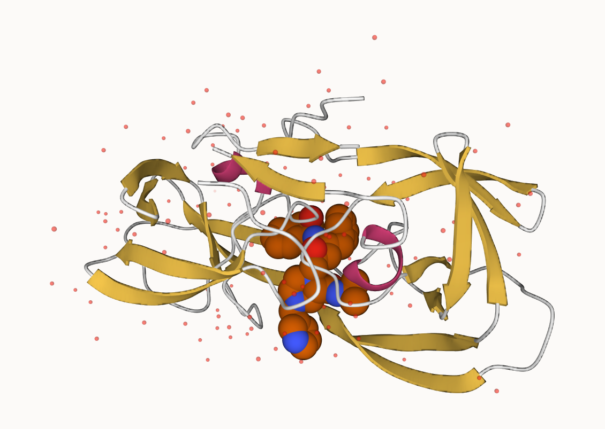
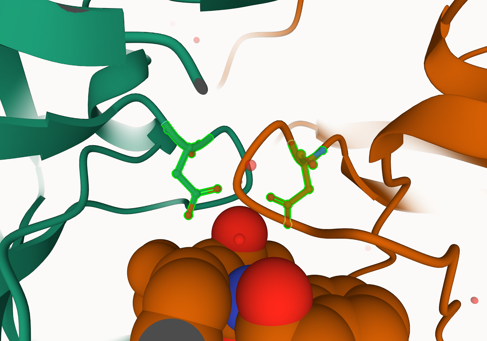
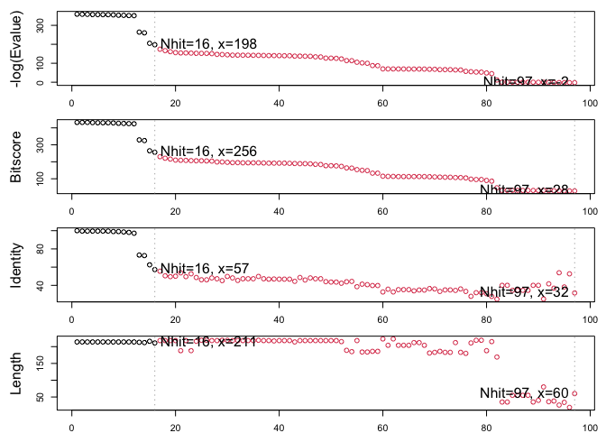

Class 9: Structural Bioinformatics
================
Elena

- <a href="#introduction-to-the-rcsb-protein-data-bank-pdb"
  id="toc-introduction-to-the-rcsb-protein-data-bank-pdb">Introduction to
  the RCSB Protein Data Bank (PDB)</a>
  - <a
    href="#q1.-what-percentage-of-structures-in-the-pdb-are-solved-by-x-ray-and-electron-microscopy."
    id="toc-q1.-what-percentage-of-structures-in-the-pdb-are-solved-by-x-ray-and-electron-microscopy.">Q1.
    What percentage of structures in the PDB are solved by X-Ray and
    Electron Microscopy.</a>
  - <a href="#q2.-what-proportion-of-structures-in-the-pdb-are-protein"
    id="toc-q2.-what-proportion-of-structures-in-the-pdb-are-protein">Q2.
    What proportion of structures in the PDB are protein?</a>
  - <a
    href="#q3.-type-hiv-in-the-pdb-website-search-box-on-the-home-page-and-determine-how-many-hiv-1-protease-structures-are-in-the-current-pdb"
    id="toc-q3.-type-hiv-in-the-pdb-website-search-box-on-the-home-page-and-determine-how-many-hiv-1-protease-structures-are-in-the-current-pdb">Q3.
    Type HIV in the PDB website search box on the home page and determine
    how many HIV-1 protease structures are in the current PDB?</a>
- <a href="#visualizing-the-hiv-1-protease-structure"
  id="toc-visualizing-the-hiv-1-protease-structure">Visualizing the HIV-1
  protease structure</a>
  - <a
    href="#q4.-water-molecules-normally-have-3-atoms.-why-do-we-see-just-one-atom-per-water-molecule-in-this-structure"
    id="toc-q4.-water-molecules-normally-have-3-atoms.-why-do-we-see-just-one-atom-per-water-molecule-in-this-structure">Q4.
    Water molecules normally have 3 atoms. Why do we see just one atom per
    water molecule in this structure?</a>
  - <a
    href="#q5.-there-is-a-critical-conserved-water-molecule-in-the-binding-site.-can-you-identify-this-water-molecule-what-residue-number-does-this-water-molecule-have"
    id="toc-q5.-there-is-a-critical-conserved-water-molecule-in-the-binding-site.-can-you-identify-this-water-molecule-what-residue-number-does-this-water-molecule-have">Q5.
    There is a critical “conserved” water molecule in the binding site. Can
    you identify this water molecule? What residue number does this water
    molecule have</a>
  - <a
    href="#q6.-generate-and-save-a-figure-clearly-showing-the-two-distinct-chains-of-hiv-protease-along-with-the-ligand.-you-might-also-consider-showing-the-catalytic-residues-asp-25-in-each-chain-and-the-critical-water-we-recommend-ball-stick-for-these-side-chains.-add-this-figure-to-your-quarto-document."
    id="toc-q6.-generate-and-save-a-figure-clearly-showing-the-two-distinct-chains-of-hiv-protease-along-with-the-ligand.-you-might-also-consider-showing-the-catalytic-residues-asp-25-in-each-chain-and-the-critical-water-we-recommend-ball-stick-for-these-side-chains.-add-this-figure-to-your-quarto-document.">Q6.
    Generate and save a figure clearly showing the two distinct chains of
    HIV-protease along with the ligand. You might also consider showing the
    catalytic residues ASP 25 in each chain and the critical water (we
    recommend “Ball &amp; Stick” for these side-chains). Add this figure to
    your Quarto document.</a>
- <a href="#introduction-to-bio3d-in-r"
  id="toc-introduction-to-bio3d-in-r">Introduction to Bio3D in R</a>
  - <a href="#q7.-how-many-amino-acid-residues-are-there-in-this-pdb-object"
    id="toc-q7.-how-many-amino-acid-residues-are-there-in-this-pdb-object">Q7.
    How many amino acid residues are there in this pdb object?</a>
  - <a href="#q8.-name-one-of-the-two-non-protein-residues"
    id="toc-q8.-name-one-of-the-two-non-protein-residues">Q8. Name one of
    the two non-protein residues?</a>
  - <a href="#q9.-how-many-protein-chains-are-in-this-structure"
    id="toc-q9.-how-many-protein-chains-are-in-this-structure">Q9. How many
    protein chains are in this structure?</a>
- <a href="#predicting-functional-motions-of-a-single-structure"
  id="toc-predicting-functional-motions-of-a-single-structure">Predicting
  functional motions of a single structure</a>
- <a href="#comparative-structure-analysis-of-adenylate-kinase"
  id="toc-comparative-structure-analysis-of-adenylate-kinase">Comparative
  structure analysis of Adenylate Kinase</a>
  - <a
    href="#q10.-which-of-the-packages-above-is-found-only-on-bioconductor-and-not-cran"
    id="toc-q10.-which-of-the-packages-above-is-found-only-on-bioconductor-and-not-cran">Q10.
    Which of the packages above is found only on BioConductor and not
    CRAN?</a>
  - <a
    href="#q11.-which-of-the-above-packages-is-not-found-on-bioconductor-or-cran"
    id="toc-q11.-which-of-the-above-packages-is-not-found-on-bioconductor-or-cran">Q11.
    Which of the above packages is not found on BioConductor or CRAN?</a>
  - <a
    href="#q12.-true-or-false-functions-from-the-devtools-package-can-be-used-to-install-packages-from-github-and-bitbucket"
    id="toc-q12.-true-or-false-functions-from-the-devtools-package-can-be-used-to-install-packages-from-github-and-bitbucket">Q12.
    True or False? Functions from the devtools package can be used to
    install packages from GitHub and BitBucket?</a>
- <a href="#search-and-retrieve-adk-structures"
  id="toc-search-and-retrieve-adk-structures">Search and retrieve ADK
  structures</a>
  - <a
    href="#q13.-how-many-amino-acids-are-in-this-sequence-i.e.-how-long-is-this-sequence"
    id="toc-q13.-how-many-amino-acids-are-in-this-sequence-i.e.-how-long-is-this-sequence">Q13.
    How many amino acids are in this sequence, i.e. how long is this
    sequence?</a>
- <a href="#align-and-superpose-structures"
  id="toc-align-and-superpose-structures">Align and superpose
  structures</a>
- <a href="#pca" id="toc-pca">PCA</a>
- <a href="#normal-mode-analysis" id="toc-normal-mode-analysis">Normal
  mode analysis</a>
  - <a
    href="#q14.-what-do-you-note-about-this-plot-are-the-black-and-colored-lines-similar-or-different-where-do-you-think-they-differ-most-and-why"
    id="toc-q14.-what-do-you-note-about-this-plot-are-the-black-and-colored-lines-similar-or-different-where-do-you-think-they-differ-most-and-why">Q14.
    What do you note about this plot? Are the black and colored lines
    similar or different? Where do you think they differ most and why?</a>

# Introduction to the RCSB Protein Data Bank (PDB)

``` r
csv <- read.csv("pdb_stats.csv")
csv
```

               Molecular.Type   X.ray    NMR    EM Multiple.methods Neutron Other
    1          Protein (only) 150,417 12,056 8,586              188      72    32
    2 Protein/Oligosaccharide   8,869     32 1,552                6       0     0
    3              Protein/NA   7,943    280 2,690                6       0     0
    4     Nucleic acid (only)   2,522  1,425    74               13       2     1
    5                   Other     154     31     6                0       0     0
    6  Oligosaccharide (only)      11      6     0                1       0     4
        Total
    1 171,351
    2  10,459
    3  10,919
    4   4,037
    5     191
    6      22

## Q1. What percentage of structures in the PDB are solved by X-Ray and Electron Microscopy.

92.8%

``` r
#Need to get rid of commas in numbers
csv_X.ray <- gsub(",", "", csv$X.ray)
csv_EM <- gsub(",", "", csv$EM)
csv_Total <- gsub(",", "", csv$Total)
(sum(as.numeric(csv_X.ray))+sum(as.numeric(csv_EM)))/sum(as.numeric(csv_Total))
```

    [1] 0.9281395

## Q2. What proportion of structures in the PDB are protein?

87.0%

``` r
as.numeric(csv_Total[1])/sum(as.numeric(csv_Total))
```

    [1] 0.8698948

## Q3. Type HIV in the PDB website search box on the home page and determine how many HIV-1 protease structures are in the current PDB?

Searched for HIV AND Protease, filtered for proteins, and yielded 1264
results. Each structure seems to be bound to different ligands.

# Visualizing the HIV-1 protease structure





## Q4. Water molecules normally have 3 atoms. Why do we see just one atom per water molecule in this structure?

Only see oxygen atom because hydrogen atoms are much smaller than
oxygen.

## Q5. There is a critical “conserved” water molecule in the binding site. Can you identify this water molecule? What residue number does this water molecule have

Residue 308.

## Q6. Generate and save a figure clearly showing the two distinct chains of HIV-protease along with the ligand. You might also consider showing the catalytic residues ASP 25 in each chain and the critical water (we recommend “Ball & Stick” for these side-chains). Add this figure to your Quarto document.


# Introduction to Bio3D in R

``` r
library(bio3d)
pdb <- read.pdb("1hsg")
```

      Note: Accessing on-line PDB file

``` r
pdb
```


     Call:  read.pdb(file = "1hsg")

       Total Models#: 1
         Total Atoms#: 1686,  XYZs#: 5058  Chains#: 2  (values: A B)

         Protein Atoms#: 1514  (residues/Calpha atoms#: 198)
         Nucleic acid Atoms#: 0  (residues/phosphate atoms#: 0)

         Non-protein/nucleic Atoms#: 172  (residues: 128)
         Non-protein/nucleic resid values: [ HOH (127), MK1 (1) ]

       Protein sequence:
          PQITLWQRPLVTIKIGGQLKEALLDTGADDTVLEEMSLPGRWKPKMIGGIGGFIKVRQYD
          QILIEICGHKAIGTVLVGPTPVNIIGRNLLTQIGCTLNFPQITLWQRPLVTIKIGGQLKE
          ALLDTGADDTVLEEMSLPGRWKPKMIGGIGGFIKVRQYDQILIEICGHKAIGTVLVGPTP
          VNIIGRNLLTQIGCTLNF

    + attr: atom, xyz, seqres, helix, sheet,
            calpha, remark, call

``` r
attributes(pdb)
```

    $names
    [1] "atom"   "xyz"    "seqres" "helix"  "sheet"  "calpha" "remark" "call"  

    $class
    [1] "pdb" "sse"

``` r
head(pdb$atom)
```

      type eleno elety  alt resid chain resno insert      x      y     z o     b
    1 ATOM     1     N <NA>   PRO     A     1   <NA> 29.361 39.686 5.862 1 38.10
    2 ATOM     2    CA <NA>   PRO     A     1   <NA> 30.307 38.663 5.319 1 40.62
    3 ATOM     3     C <NA>   PRO     A     1   <NA> 29.760 38.071 4.022 1 42.64
    4 ATOM     4     O <NA>   PRO     A     1   <NA> 28.600 38.302 3.676 1 43.40
    5 ATOM     5    CB <NA>   PRO     A     1   <NA> 30.508 37.541 6.342 1 37.87
    6 ATOM     6    CG <NA>   PRO     A     1   <NA> 29.296 37.591 7.162 1 38.40
      segid elesy charge
    1  <NA>     N   <NA>
    2  <NA>     C   <NA>
    3  <NA>     C   <NA>
    4  <NA>     O   <NA>
    5  <NA>     C   <NA>
    6  <NA>     C   <NA>

## Q7. How many amino acid residues are there in this pdb object?

198. 

## Q8. Name one of the two non-protein residues?

HOH (H2O).

## Q9. How many protein chains are in this structure?

2 chains.

# Predicting functional motions of a single structure

``` r
adk <- read.pdb("6s36")
```

      Note: Accessing on-line PDB file
       PDB has ALT records, taking A only, rm.alt=TRUE

``` r
adk
```


     Call:  read.pdb(file = "6s36")

       Total Models#: 1
         Total Atoms#: 1898,  XYZs#: 5694  Chains#: 1  (values: A)

         Protein Atoms#: 1654  (residues/Calpha atoms#: 214)
         Nucleic acid Atoms#: 0  (residues/phosphate atoms#: 0)

         Non-protein/nucleic Atoms#: 244  (residues: 244)
         Non-protein/nucleic resid values: [ CL (3), HOH (238), MG (2), NA (1) ]

       Protein sequence:
          MRIILLGAPGAGKGTQAQFIMEKYGIPQISTGDMLRAAVKSGSELGKQAKDIMDAGKLVT
          DELVIALVKERIAQEDCRNGFLLDGFPRTIPQADAMKEAGINVDYVLEFDVPDELIVDKI
          VGRRVHAPSGRVYHVKFNPPKVEGKDDVTGEELTTRKDDQEETVRKRLVEYHQMTAPLIG
          YYSKEAEAGNTKYAKVDGTKPVAEVRADLEKILG

    + attr: atom, xyz, seqres, helix, sheet,
            calpha, remark, call

NMA to predict protein flexibility and potential functional motions
(conformational changes)

``` r
m <- nma(adk)
```

     Building Hessian...        Done in 0.087 seconds.
     Diagonalizing Hessian...   Done in 0.259 seconds.

``` r
plot(m)
```


``` r
#mktrj(m, file="adk_m7.pdb")
```

# Comparative structure analysis of Adenylate Kinase

“The `install.packages()` function is used to install packages from the
main CRAN repository for R packages. BioConductor is a separate
repository of R packages focused on high-throughput biomolecular assays
and biomolecular data. Packages from BioConductor can be installed using
the `BiocManager::install()` function. Finally, R packages found on
GitHub or BitBucket can be installed using `devtools::install_github()`
and `devtools::install_bitbucket()` functions.”

``` r
#install.packages("bio3d")
#install.packages("devtools")
#install.packages("BiocManager")

#BiocManager::install("msa")
#devtools::install_bitbucket("Grantlab/bio3d-view")
```

## Q10. Which of the packages above is found only on BioConductor and not CRAN?

msa.

## Q11. Which of the above packages is not found on BioConductor or CRAN?

bio3d-view.

## Q12. True or False? Functions from the devtools package can be used to install packages from GitHub and BitBucket?

True.

# Search and retrieve ADK structures

``` r
library(bio3d)
aa <- get.seq("1ake_A")
```

    Warning in get.seq("1ake_A"): Removing existing file: seqs.fasta

    Fetching... Please wait. Done.

``` r
aa
```

                 1        .         .         .         .         .         60 
    pdb|1AKE|A   MRIILLGAPGAGKGTQAQFIMEKYGIPQISTGDMLRAAVKSGSELGKQAKDIMDAGKLVT
                 1        .         .         .         .         .         60 

                61        .         .         .         .         .         120 
    pdb|1AKE|A   DELVIALVKERIAQEDCRNGFLLDGFPRTIPQADAMKEAGINVDYVLEFDVPDELIVDRI
                61        .         .         .         .         .         120 

               121        .         .         .         .         .         180 
    pdb|1AKE|A   VGRRVHAPSGRVYHVKFNPPKVEGKDDVTGEELTTRKDDQEETVRKRLVEYHQMTAPLIG
               121        .         .         .         .         .         180 

               181        .         .         .   214 
    pdb|1AKE|A   YYSKEAEAGNTKYAKVDGTKPVAEVRADLEKILG
               181        .         .         .   214 

    Call:
      read.fasta(file = outfile)

    Class:
      fasta

    Alignment dimensions:
      1 sequence rows; 214 position columns (214 non-gap, 0 gap) 

    + attr: id, ali, call

## Q13. How many amino acids are in this sequence, i.e. how long is this sequence?

214. 

``` r
#Blast or hmmer search 
b <- blast.pdb(aa)
```

     Searching ... please wait (updates every 5 seconds) RID = SRAYCEZS016 
     .
     Reporting 97 hits

``` r
#Plot a summary of search results
hits <- plot(b)
```

      * Possible cutoff values:    197 -3 
                Yielding Nhits:    16 97 

      * Chosen cutoff value of:    197 
                Yielding Nhits:    16 



``` r
#List out some 'top hits'
head(hits$pdb.id)
```

    [1] "1AKE_A" "4X8M_A" "6S36_A" "6RZE_A" "4X8H_A" "3HPR_A"

``` r
#There are 16 hits, but will use the ones listed on the workbook
```

``` r
hits <- NULL
hits$pdb.id <- c('1AKE_A','6S36_A','6RZE_A','3HPR_A','1E4V_A','5EJE_A','1E4Y_A','3X2S_A','6HAP_A','6HAM_A','4K46_A','3GMT_A','4PZL_A')
```

``` r
# Download releated PDB files
files <- get.pdb(hits$pdb.id, path="pdbs", split=TRUE, gzip=TRUE)
```

    Warning in get.pdb(hits$pdb.id, path = "pdbs", split = TRUE, gzip = TRUE): pdbs/
    1AKE.pdb.gz exists. Skipping download

    Warning in get.pdb(hits$pdb.id, path = "pdbs", split = TRUE, gzip = TRUE): pdbs/
    6S36.pdb.gz exists. Skipping download

    Warning in get.pdb(hits$pdb.id, path = "pdbs", split = TRUE, gzip = TRUE): pdbs/
    6RZE.pdb.gz exists. Skipping download

    Warning in get.pdb(hits$pdb.id, path = "pdbs", split = TRUE, gzip = TRUE): pdbs/
    3HPR.pdb.gz exists. Skipping download

    Warning in get.pdb(hits$pdb.id, path = "pdbs", split = TRUE, gzip = TRUE): pdbs/
    1E4V.pdb.gz exists. Skipping download

    Warning in get.pdb(hits$pdb.id, path = "pdbs", split = TRUE, gzip = TRUE): pdbs/
    5EJE.pdb.gz exists. Skipping download

    Warning in get.pdb(hits$pdb.id, path = "pdbs", split = TRUE, gzip = TRUE): pdbs/
    1E4Y.pdb.gz exists. Skipping download

    Warning in get.pdb(hits$pdb.id, path = "pdbs", split = TRUE, gzip = TRUE): pdbs/
    3X2S.pdb.gz exists. Skipping download

    Warning in get.pdb(hits$pdb.id, path = "pdbs", split = TRUE, gzip = TRUE): pdbs/
    6HAP.pdb.gz exists. Skipping download

    Warning in get.pdb(hits$pdb.id, path = "pdbs", split = TRUE, gzip = TRUE): pdbs/
    6HAM.pdb.gz exists. Skipping download

    Warning in get.pdb(hits$pdb.id, path = "pdbs", split = TRUE, gzip = TRUE): pdbs/
    4K46.pdb.gz exists. Skipping download

    Warning in get.pdb(hits$pdb.id, path = "pdbs", split = TRUE, gzip = TRUE): pdbs/
    3GMT.pdb.gz exists. Skipping download

    Warning in get.pdb(hits$pdb.id, path = "pdbs", split = TRUE, gzip = TRUE): pdbs/
    4PZL.pdb.gz exists. Skipping download


      |                                                                            
      |                                                                      |   0%
      |                                                                            
      |=====                                                                 |   8%
      |                                                                            
      |===========                                                           |  15%
      |                                                                            
      |================                                                      |  23%
      |                                                                            
      |======================                                                |  31%
      |                                                                            
      |===========================                                           |  38%
      |                                                                            
      |================================                                      |  46%
      |                                                                            
      |======================================                                |  54%
      |                                                                            
      |===========================================                           |  62%
      |                                                                            
      |================================================                      |  69%
      |                                                                            
      |======================================================                |  77%
      |                                                                            
      |===========================================================           |  85%
      |                                                                            
      |=================================================================     |  92%
      |                                                                            
      |======================================================================| 100%

# Align and superpose structures

``` r
#Align releated PDBs
pdbs <- pdbaln(files, fit = TRUE, exefile="msa")
```

    Reading PDB files:
    pdbs/split_chain/1AKE_A.pdb
    pdbs/split_chain/6S36_A.pdb
    pdbs/split_chain/6RZE_A.pdb
    pdbs/split_chain/3HPR_A.pdb
    pdbs/split_chain/1E4V_A.pdb
    pdbs/split_chain/5EJE_A.pdb
    pdbs/split_chain/1E4Y_A.pdb
    pdbs/split_chain/3X2S_A.pdb
    pdbs/split_chain/6HAP_A.pdb
    pdbs/split_chain/6HAM_A.pdb
    pdbs/split_chain/4K46_A.pdb
    pdbs/split_chain/3GMT_A.pdb
    pdbs/split_chain/4PZL_A.pdb
       PDB has ALT records, taking A only, rm.alt=TRUE
    .   PDB has ALT records, taking A only, rm.alt=TRUE
    .   PDB has ALT records, taking A only, rm.alt=TRUE
    .   PDB has ALT records, taking A only, rm.alt=TRUE
    ..   PDB has ALT records, taking A only, rm.alt=TRUE
    ....   PDB has ALT records, taking A only, rm.alt=TRUE
    .   PDB has ALT records, taking A only, rm.alt=TRUE
    ...

    Extracting sequences

    pdb/seq: 1   name: pdbs/split_chain/1AKE_A.pdb 
       PDB has ALT records, taking A only, rm.alt=TRUE
    pdb/seq: 2   name: pdbs/split_chain/6S36_A.pdb 
       PDB has ALT records, taking A only, rm.alt=TRUE
    pdb/seq: 3   name: pdbs/split_chain/6RZE_A.pdb 
       PDB has ALT records, taking A only, rm.alt=TRUE
    pdb/seq: 4   name: pdbs/split_chain/3HPR_A.pdb 
       PDB has ALT records, taking A only, rm.alt=TRUE
    pdb/seq: 5   name: pdbs/split_chain/1E4V_A.pdb 
    pdb/seq: 6   name: pdbs/split_chain/5EJE_A.pdb 
       PDB has ALT records, taking A only, rm.alt=TRUE
    pdb/seq: 7   name: pdbs/split_chain/1E4Y_A.pdb 
    pdb/seq: 8   name: pdbs/split_chain/3X2S_A.pdb 
    pdb/seq: 9   name: pdbs/split_chain/6HAP_A.pdb 
    pdb/seq: 10   name: pdbs/split_chain/6HAM_A.pdb 
       PDB has ALT records, taking A only, rm.alt=TRUE
    pdb/seq: 11   name: pdbs/split_chain/4K46_A.pdb 
       PDB has ALT records, taking A only, rm.alt=TRUE
    pdb/seq: 12   name: pdbs/split_chain/3GMT_A.pdb 
    pdb/seq: 13   name: pdbs/split_chain/4PZL_A.pdb 

``` r
#Vector containing PDB codes for figure axis
#ids <- basename.pdb(pdbs$id)

#Draw schematic alignment
#plot(pdbs, labels=ids)

#Worked!
#But is causing issues with PDF export so not including in the report
```

``` r
#anno <- pdb.annotate(ids)
#unique(anno$source)
```

# PCA

``` r
#PCA
pc.xray<- pca(pdbs)
plot(pc.xray)
```


``` r
#Visualize first principal component
#mktrj(pc.xray, pc=1, file="pc_1.pdb")
```

``` r
#Calculate RMSD
rd <- rmsd(pdbs)
```

    Warning in rmsd(pdbs): No indices provided, using the 204 non NA positions

``` r
#Structure-based clustering
hc.rd <- hclust(dist(rd))
grps.rd <- cutree(hc.rd, k=3)

plot(pc.xray, 1:2, col="grey50", bg=grps.rd, pch=21, cex=1)
```


# Normal mode analysis

``` r
#NMA of all structures
modes <- nma(pdbs)
```


    Details of Scheduled Calculation:
      ... 13 input structures 
      ... storing 606 eigenvectors for each structure 
      ... dimension of x$U.subspace: ( 612x606x13 )
      ... coordinate superposition prior to NM calculation 
      ... aligned eigenvectors (gap containing positions removed)  
      ... estimated memory usage of final 'eNMA' object: 36.9 Mb 


      |                                                                            
      |                                                                      |   0%
      |                                                                            
      |=====                                                                 |   8%
      |                                                                            
      |===========                                                           |  15%
      |                                                                            
      |================                                                      |  23%
      |                                                                            
      |======================                                                |  31%
      |                                                                            
      |===========================                                           |  38%
      |                                                                            
      |================================                                      |  46%
      |                                                                            
      |======================================                                |  54%
      |                                                                            
      |===========================================                           |  62%
      |                                                                            
      |================================================                      |  69%
      |                                                                            
      |======================================================                |  77%
      |                                                                            
      |===========================================================           |  85%
      |                                                                            
      |=================================================================     |  92%
      |                                                                            
      |======================================================================| 100%

``` r
plot(modes, pdbs, col=grps.rd)
```

    Extracting SSE from pdbs$sse attribute


## Q14. What do you note about this plot? Are the black and colored lines similar or different? Where do you think they differ most and why?

There are regions where the curves are similar and regions that are
different. Perhaps different most in sites that are not the active site.
These proteins are similar supposedly because they share similar
catalytic activity as conferred by the active site.
