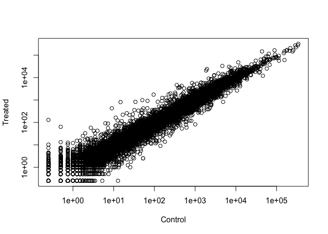

Class 12: Transcriptomics & Analysis of RNA-Seq Data
================
Elena

- <a href="#bioconductor-and-deseq2-setup"
  id="toc-bioconductor-and-deseq2-setup">Bioconductor and DESeq2 setup</a>
- <a href="#import-countdata-and-coldata"
  id="toc-import-countdata-and-coldata">Import countData and colData</a>
  - <a href="#check-data-structure" id="toc-check-data-structure">Check data
    structure</a>
  - <a href="#q1.-how-many-genes-are-in-this-dataset"
    id="toc-q1.-how-many-genes-are-in-this-dataset">Q1. How many genes are
    in this dataset?</a>
  - <a href="#q2.-how-many-control-cell-lines-do-we-have"
    id="toc-q2.-how-many-control-cell-lines-do-we-have">Q2. How many
    ‘control’ cell lines do we have?</a>
- <a href="#toy-differential-gene-expression"
  id="toc-toy-differential-gene-expression">Toy differential gene
  expression</a>
  - <a
    href="#q3.-how-would-you-make-the-above-code-in-either-approach-more-robust"
    id="toc-q3.-how-would-you-make-the-above-code-in-either-approach-more-robust">Q3.
    How would you make the above code in either approach more robust?</a>
  - <a
    href="#q4.-follow-the-same-procedure-for-the-treated-samples-i.e.-calculate-the-mean-per-gene-across-drug-treated-samples-and-assign-to-a-labeled-vector-called-treated.mean"
    id="toc-q4.-follow-the-same-procedure-for-the-treated-samples-i.e.-calculate-the-mean-per-gene-across-drug-treated-samples-and-assign-to-a-labeled-vector-called-treated.mean">Q4.
    Follow the same procedure for the treated samples (i.e. calculate the
    mean per gene across drug treated samples and assign to a labeled vector
    called treated.mean)</a>
  - <a
    href="#q5-a.-create-a-scatter-plot-showing-the-mean-of-the-treated-samples-against-the-mean-of-the-control-samples."
    id="toc-q5-a.-create-a-scatter-plot-showing-the-mean-of-the-treated-samples-against-the-mean-of-the-control-samples.">Q5
    (a). Create a scatter plot showing the mean of the treated samples
    against the mean of the control samples.</a>
  - <a
    href="#q5-b.you-could-also-use-the-ggplot2-package-to-make-this-figure-producing-the-plot-below.-what-geom_-function-would-you-use-for-this-plot"
    id="toc-q5-b.you-could-also-use-the-ggplot2-package-to-make-this-figure-producing-the-plot-below.-what-geom_-function-would-you-use-for-this-plot">Q5
    (b).You could also use the ggplot2 package to make this figure producing
    the plot below. What geom_?() function would you use for this plot?</a>
  - <a
    href="#q6.-try-plotting-both-axes-on-a-log-scale.-what-is-the-argument-to-plot-that-allows-you-to-do-this"
    id="toc-q6.-try-plotting-both-axes-on-a-log-scale.-what-is-the-argument-to-plot-that-allows-you-to-do-this">Q6.
    Try plotting both axes on a log scale. What is the argument to plot()
    that allows you to do this?</a>
  - <a
    href="#q7.-what-is-the-purpose-of-the-arr.ind-argument-in-the-which-function-call-above-why-would-we-then-take-the-first-column-of-the-output-and-need-to-call-the-unique-function"
    id="toc-q7.-what-is-the-purpose-of-the-arr.ind-argument-in-the-which-function-call-above-why-would-we-then-take-the-first-column-of-the-output-and-need-to-call-the-unique-function">Q7.
    What is the purpose of the arr.ind argument in the which() function call
    above? Why would we then take the first column of the output and need to
    call the unique() function?</a>
  - <a
    href="#q8.-using-the-up.ind-vector-above-can-you-determine-how-many-up-regulated-genes-we-have-at-the-greater-than-2-fc-level"
    id="toc-q8.-using-the-up.ind-vector-above-can-you-determine-how-many-up-regulated-genes-we-have-at-the-greater-than-2-fc-level">Q8.
    Using the up.ind vector above can you determine how many up regulated
    genes we have at the greater than 2 fc level?</a>
  - <a
    href="#q9.-using-the-down.ind-vector-above-can-you-determine-how-many-down-regulated-genes-we-have-at-the-greater-than-2-fc-level"
    id="toc-q9.-using-the-down.ind-vector-above-can-you-determine-how-many-down-regulated-genes-we-have-at-the-greater-than-2-fc-level">Q9.
    Using the down.ind vector above can you determine how many down
    regulated genes we have at the greater than 2 fc level?</a>
  - <a href="#q10.-do-you-trust-these-results-why-or-why-not"
    id="toc-q10.-do-you-trust-these-results-why-or-why-not">Q10. Do you
    trust these results? Why or why not?</a>
- <a href="#deseq2-analysis" id="toc-deseq2-analysis">DESeq2 analysis</a>
- <a href="#data-visualization" id="toc-data-visualization">Data
  Visualization</a>
- <a href="#picking-up-from-last-time-gene-annotation"
  id="toc-picking-up-from-last-time-gene-annotation">Picking up from last
  time… Gene annotation</a>
  - <a href="#pathway-analysis" id="toc-pathway-analysis">Pathway
    Analysis</a>

# Bioconductor and DESeq2 setup

``` r
library(BiocManager)
library(DESeq2)
```

# Import countData and colData

We need at least two things:

- count data (genes in rows and experiments in cols)

- metadata (aka. `colData`)

``` r
counts <- read.csv("airway_scaledcounts.csv", row.names=1)
metadata <-  read.csv("airway_metadata.csv")
```

## Check data structure

``` r
head(counts)
```

                    SRR1039508 SRR1039509 SRR1039512 SRR1039513 SRR1039516
    ENSG00000000003        723        486        904        445       1170
    ENSG00000000005          0          0          0          0          0
    ENSG00000000419        467        523        616        371        582
    ENSG00000000457        347        258        364        237        318
    ENSG00000000460         96         81         73         66        118
    ENSG00000000938          0          0          1          0          2
                    SRR1039517 SRR1039520 SRR1039521
    ENSG00000000003       1097        806        604
    ENSG00000000005          0          0          0
    ENSG00000000419        781        417        509
    ENSG00000000457        447        330        324
    ENSG00000000460         94        102         74
    ENSG00000000938          0          0          0

``` r
head(metadata)
```

              id     dex celltype     geo_id
    1 SRR1039508 control   N61311 GSM1275862
    2 SRR1039509 treated   N61311 GSM1275863
    3 SRR1039512 control  N052611 GSM1275866
    4 SRR1039513 treated  N052611 GSM1275867
    5 SRR1039516 control  N080611 GSM1275870
    6 SRR1039517 treated  N080611 GSM1275871

We can use the `==` to test for equality - is the right side equal to
the left side (T/F). We can use the `all` function to check if all the
inputs are T.

``` r
all(colnames(counts) == metadata$id)
```

    [1] TRUE

## Q1. How many genes are in this dataset?

38694 genes.

``` r
nrow(counts)
```

    [1] 38694

## Q2. How many ‘control’ cell lines do we have?

4 control cell lines.

``` r
table(metadata$dex)
```


    control treated 
          4       4 

# Toy differential gene expression

``` r
control.inds <- metadata$dex == "control"
control.ids <- metadata[control.inds,"id"]
control.counts <- counts[,control.ids]
head(control.counts)
```

                    SRR1039508 SRR1039512 SRR1039516 SRR1039520
    ENSG00000000003        723        904       1170        806
    ENSG00000000005          0          0          0          0
    ENSG00000000419        467        616        582        417
    ENSG00000000457        347        364        318        330
    ENSG00000000460         96         73        118        102
    ENSG00000000938          0          1          2          0

``` r
#We want a mean value across these rows (i.e. a mean count per gene)
control.mean <- rowMeans(control.counts)
head(control.mean)
```

    ENSG00000000003 ENSG00000000005 ENSG00000000419 ENSG00000000457 ENSG00000000460 
             900.75            0.00          520.50          339.75           97.25 
    ENSG00000000938 
               0.75 

``` r
control <- metadata[metadata[,"dex"]=="control",]
control.counts <- counts[ ,control$id]
control.mean <- rowSums(control.counts)/4 
head(control.mean)
```

    ENSG00000000003 ENSG00000000005 ENSG00000000419 ENSG00000000457 ENSG00000000460 
             900.75            0.00          520.50          339.75           97.25 
    ENSG00000000938 
               0.75 

``` r
library(dplyr)
control <- metadata %>% filter(dex=="control")
control.counts <- counts %>% select(control$id) 
control.mean <- rowSums(control.counts)/4
head(control.mean)
```

    ENSG00000000003 ENSG00000000005 ENSG00000000419 ENSG00000000457 ENSG00000000460 
             900.75            0.00          520.50          339.75           97.25 
    ENSG00000000938 
               0.75 

``` r
length(which("control"==metadata$dex))
```

    [1] 4

## Q3. How would you make the above code in either approach more robust?

Instead of dividing by 4 when calculating the control.mean, divide by
the number of control samples (e.g.,
`length(which("control"==metadata$dex))`). Can also make the code into a
function so that we can just input one variable.

## Q4. Follow the same procedure for the treated samples (i.e. calculate the mean per gene across drug treated samples and assign to a labeled vector called treated.mean)

``` r
treated <- metadata %>% filter(dex=="treated")
treated.counts <- counts %>% select(treated$id) 
treated.mean <- rowSums(treated.counts)/4
head(treated.mean)
```

    ENSG00000000003 ENSG00000000005 ENSG00000000419 ENSG00000000457 ENSG00000000460 
             658.00            0.00          546.00          316.50           78.75 
    ENSG00000000938 
               0.00 

``` r
meancounts <- data.frame(control.mean, treated.mean)
colSums(meancounts)
```

    control.mean treated.mean 
        23005324     22196524 

## Q5 (a). Create a scatter plot showing the mean of the treated samples against the mean of the control samples.

``` r
plot(meancounts, xlab="Control", ylab="Treated")
```


## Q5 (b).You could also use the ggplot2 package to make this figure producing the plot below. What geom\_?() function would you use for this plot?

geom_point()

``` r
library(ggplot2)
ggplot(meancounts) + 
  aes(x=control.mean,y=treated.mean) + 
  geom_point() +
  labs(x="Control", y="Treated")
```


## Q6. Try plotting both axes on a log scale. What is the argument to plot() that allows you to do this?

For ggplot, `scale_x_log10()` and `scale_y_log10()`. For base R plot,
`log="xy"`.

``` r
plot(meancounts, xlab="Control", ylab="Treated", log="xy")
```

    Warning in xy.coords(x, y, xlabel, ylabel, log): 15032 x values <= 0 omitted
    from logarithmic plot

    Warning in xy.coords(x, y, xlabel, ylabel, log): 15281 y values <= 0 omitted
    from logarithmic plot



``` r
ggplot(meancounts) + 
  aes(x=control.mean,y=treated.mean) + 
  geom_point() +
  scale_x_log10() + scale_y_log10() +
  labs(x="Control", y="Treated")
```

    Warning: Transformation introduced infinite values in continuous x-axis

    Warning: Transformation introduced infinite values in continuous y-axis


Adding Log2(FoldChange)

``` r
meancounts$log2fc <- log2(meancounts[,"treated.mean"]/meancounts[,"control.mean"])
head(meancounts)
```

                    control.mean treated.mean      log2fc
    ENSG00000000003       900.75       658.00 -0.45303916
    ENSG00000000005         0.00         0.00         NaN
    ENSG00000000419       520.50       546.00  0.06900279
    ENSG00000000457       339.75       316.50 -0.10226805
    ENSG00000000460        97.25        78.75 -0.30441833
    ENSG00000000938         0.75         0.00        -Inf

``` r
zero.vals <- which(meancounts[,1:2]==0, arr.ind=TRUE)

to.rm <- unique(zero.vals[,1])
mycounts <- meancounts[-to.rm,]
head(mycounts)
```

                    control.mean treated.mean      log2fc
    ENSG00000000003       900.75       658.00 -0.45303916
    ENSG00000000419       520.50       546.00  0.06900279
    ENSG00000000457       339.75       316.50 -0.10226805
    ENSG00000000460        97.25        78.75 -0.30441833
    ENSG00000000971      5219.00      6687.50  0.35769358
    ENSG00000001036      2327.00      1785.75 -0.38194109

or…

``` r
to.keep.inds <- rowSums(meancounts[,1:2]==0) == 0
mycounts <- meancounts[to.keep.inds,]
head(mycounts)
```

                    control.mean treated.mean      log2fc
    ENSG00000000003       900.75       658.00 -0.45303916
    ENSG00000000419       520.50       546.00  0.06900279
    ENSG00000000457       339.75       316.50 -0.10226805
    ENSG00000000460        97.25        78.75 -0.30441833
    ENSG00000000971      5219.00      6687.50  0.35769358
    ENSG00000001036      2327.00      1785.75 -0.38194109

``` r
nrow(mycounts)
```

    [1] 21817

## Q7. What is the purpose of the arr.ind argument in the which() function call above? Why would we then take the first column of the output and need to call the unique() function?

The `arr.ind=TRUE` argument returns the row and column indices where the
values are True (ie. rows/columns where there are zero counts).
`unique()` ensures we don’t count each row twice if it has two zero
entries.

``` r
?which
```

    Help on topic 'which' was found in the following packages:

      Package               Library
      base                  /Library/Frameworks/R.framework/Resources/library
      BiocGenerics          /Library/Frameworks/R.framework/Versions/4.2/Resources/library


    Using the first match ...

A common threshold is 2/-2 FC.

``` r
#How many genes are upregulated at log2(FC) of +2 or greater?
sum(mycounts$log2fc>=2)
```

    [1] 314

## Q8. Using the up.ind vector above can you determine how many up regulated genes we have at the greater than 2 fc level?

250. 

``` r
up.ind <- mycounts$log2fc > 2
sum(up.ind)
```

    [1] 250

## Q9. Using the down.ind vector above can you determine how many down regulated genes we have at the greater than 2 fc level?

367. 

``` r
down.ind <- mycounts$log2fc < (-2)
sum(down.ind)
```

    [1] 367

## Q10. Do you trust these results? Why or why not?

No. We would need the p value to see if the fold change is statistically
significant.

# DESeq2 analysis

It wants counts and colData and the “design” - aka. what to compare.

``` r
library(DESeq2)
```

``` r
dds <- DESeqDataSetFromMatrix(countData = counts,
                              colData = metadata,
                              design = ~dex)
```

    converting counts to integer mode

    Warning in DESeqDataSet(se, design = design, ignoreRank): some variables in
    design formula are characters, converting to factors

``` r
dds <- DESeq(dds)
```

    estimating size factors

    estimating dispersions

    gene-wise dispersion estimates

    mean-dispersion relationship

    final dispersion estimates

    fitting model and testing

``` r
res <- results(dds)
```

``` r
head(res)
```

    log2 fold change (MLE): dex treated vs control 
    Wald test p-value: dex treated vs control 
    DataFrame with 6 rows and 6 columns
                      baseMean log2FoldChange     lfcSE      stat    pvalue
                     <numeric>      <numeric> <numeric> <numeric> <numeric>
    ENSG00000000003 747.194195     -0.3507030  0.168246 -2.084470 0.0371175
    ENSG00000000005   0.000000             NA        NA        NA        NA
    ENSG00000000419 520.134160      0.2061078  0.101059  2.039475 0.0414026
    ENSG00000000457 322.664844      0.0245269  0.145145  0.168982 0.8658106
    ENSG00000000460  87.682625     -0.1471420  0.257007 -0.572521 0.5669691
    ENSG00000000938   0.319167     -1.7322890  3.493601 -0.495846 0.6200029
                         padj
                    <numeric>
    ENSG00000000003  0.163035
    ENSG00000000005        NA
    ENSG00000000419  0.176032
    ENSG00000000457  0.961694
    ENSG00000000460  0.815849
    ENSG00000000938        NA

``` r
res05 <- results(dds, alpha=0.05)
summary(res05)
```


    out of 25258 with nonzero total read count
    adjusted p-value < 0.05
    LFC > 0 (up)       : 1236, 4.9%
    LFC < 0 (down)     : 933, 3.7%
    outliers [1]       : 142, 0.56%
    low counts [2]     : 9033, 36%
    (mean count < 6)
    [1] see 'cooksCutoff' argument of ?results
    [2] see 'independentFiltering' argument of ?results

# Data Visualization

``` r
plot( res$log2FoldChange,  res$padj, 
      xlab="Log2(FoldChange)",
      ylab="padj")
```


``` r
#Take log of p-value
plot( res$log2FoldChange,  -log(res$padj), 
      xlab="Log2(FoldChange)",
      ylab="-Log(P-value)")
abline(v=c(-2,2), col="red", lty=2)
abline(h=-log(0.05), col="red", lty=2)
```


``` r
# Setup our custom point color vector 
mycols <- rep("gray", nrow(res))
mycols[ abs(res$log2FoldChange) > 2 ]  <- "red" 

inds <- (res$padj < 0.01) & (abs(res$log2FoldChange) > 2 )
mycols[ inds ] <- "blue"

# Volcano plot with custom colors 
plot( res$log2FoldChange,  -log(res$padj), 
 col=mycols, ylab="-Log(P-value)", xlab="Log2(FoldChange)" )

# Cut-off lines
abline(v=c(-2,2), col="gray", lty=2)
abline(h=-log(0.1), col="gray", lty=2)
```


# Picking up from last time… Gene annotation

``` r
#BiocManager::install("AnnotationDbi")
#BiocManager::install("org.Hs.eg.db")
library("AnnotationDbi")
```


    Attaching package: 'AnnotationDbi'

    The following object is masked from 'package:dplyr':

        select

``` r
library("org.Hs.eg.db")
```

Databases available through “org.Hs.eg.db”:

``` r
columns(org.Hs.eg.db)
```

     [1] "ACCNUM"       "ALIAS"        "ENSEMBL"      "ENSEMBLPROT"  "ENSEMBLTRANS"
     [6] "ENTREZID"     "ENZYME"       "EVIDENCE"     "EVIDENCEALL"  "GENENAME"    
    [11] "GENETYPE"     "GO"           "GOALL"        "IPI"          "MAP"         
    [16] "OMIM"         "ONTOLOGY"     "ONTOLOGYALL"  "PATH"         "PFAM"        
    [21] "PMID"         "PROSITE"      "REFSEQ"       "SYMBOL"       "UCSCKG"      
    [26] "UNIPROT"     

``` r
head(res)
```

    log2 fold change (MLE): dex treated vs control 
    Wald test p-value: dex treated vs control 
    DataFrame with 6 rows and 6 columns
                      baseMean log2FoldChange     lfcSE      stat    pvalue
                     <numeric>      <numeric> <numeric> <numeric> <numeric>
    ENSG00000000003 747.194195     -0.3507030  0.168246 -2.084470 0.0371175
    ENSG00000000005   0.000000             NA        NA        NA        NA
    ENSG00000000419 520.134160      0.2061078  0.101059  2.039475 0.0414026
    ENSG00000000457 322.664844      0.0245269  0.145145  0.168982 0.8658106
    ENSG00000000460  87.682625     -0.1471420  0.257007 -0.572521 0.5669691
    ENSG00000000938   0.319167     -1.7322890  3.493601 -0.495846 0.6200029
                         padj
                    <numeric>
    ENSG00000000003  0.163035
    ENSG00000000005        NA
    ENSG00000000419  0.176032
    ENSG00000000457  0.961694
    ENSG00000000460  0.815849
    ENSG00000000938        NA

``` r
res$symbol <- mapIds(org.Hs.eg.db,        #The database
                     keys=row.names(res), #Our genenames
                     keytype="ENSEMBL",   #The format of our genenames
                     column="SYMBOL",     #The new format we want to add
                     multiVals="first")   #Default is the first isoform of the gene
```

    'select()' returned 1:many mapping between keys and columns

``` r
head(res)
```

    log2 fold change (MLE): dex treated vs control 
    Wald test p-value: dex treated vs control 
    DataFrame with 6 rows and 7 columns
                      baseMean log2FoldChange     lfcSE      stat    pvalue
                     <numeric>      <numeric> <numeric> <numeric> <numeric>
    ENSG00000000003 747.194195     -0.3507030  0.168246 -2.084470 0.0371175
    ENSG00000000005   0.000000             NA        NA        NA        NA
    ENSG00000000419 520.134160      0.2061078  0.101059  2.039475 0.0414026
    ENSG00000000457 322.664844      0.0245269  0.145145  0.168982 0.8658106
    ENSG00000000460  87.682625     -0.1471420  0.257007 -0.572521 0.5669691
    ENSG00000000938   0.319167     -1.7322890  3.493601 -0.495846 0.6200029
                         padj      symbol
                    <numeric> <character>
    ENSG00000000003  0.163035      TSPAN6
    ENSG00000000005        NA        TNMD
    ENSG00000000419  0.176032        DPM1
    ENSG00000000457  0.961694       SCYL3
    ENSG00000000460  0.815849    C1orf112
    ENSG00000000938        NA         FGR

``` r
res$entrez <- mapIds(org.Hs.eg.db,        #The database
                     keys=row.names(res), #Our genenames
                     keytype="ENSEMBL",   #The format of our genenames
                     column="ENTREZID",     #The new format we want to add
                     multiVals="first")   #Default is the first isoform of the gene
```

    'select()' returned 1:many mapping between keys and columns

``` r
head(res)
```

    log2 fold change (MLE): dex treated vs control 
    Wald test p-value: dex treated vs control 
    DataFrame with 6 rows and 8 columns
                      baseMean log2FoldChange     lfcSE      stat    pvalue
                     <numeric>      <numeric> <numeric> <numeric> <numeric>
    ENSG00000000003 747.194195     -0.3507030  0.168246 -2.084470 0.0371175
    ENSG00000000005   0.000000             NA        NA        NA        NA
    ENSG00000000419 520.134160      0.2061078  0.101059  2.039475 0.0414026
    ENSG00000000457 322.664844      0.0245269  0.145145  0.168982 0.8658106
    ENSG00000000460  87.682625     -0.1471420  0.257007 -0.572521 0.5669691
    ENSG00000000938   0.319167     -1.7322890  3.493601 -0.495846 0.6200029
                         padj      symbol      entrez
                    <numeric> <character> <character>
    ENSG00000000003  0.163035      TSPAN6        7105
    ENSG00000000005        NA        TNMD       64102
    ENSG00000000419  0.176032        DPM1        8813
    ENSG00000000457  0.961694       SCYL3       57147
    ENSG00000000460  0.815849    C1orf112       55732
    ENSG00000000938        NA         FGR        2268

## Pathway Analysis

The two main databases or gene-sets that folks often start their
analyses with are GO and KEGG.

We will use the **gage** package to start with.

``` r
#BiocManager::install( c("pathview", "gage", "gageData") )
library(pathview)
library(gage)
library(gageData)

data(kegg.sets.hs)

# Examine the first 2 pathways in this kegg set for humans
head(kegg.sets.hs, 2)
```

    $`hsa00232 Caffeine metabolism`
    [1] "10"   "1544" "1548" "1549" "1553" "7498" "9"   

    $`hsa00983 Drug metabolism - other enzymes`
     [1] "10"     "1066"   "10720"  "10941"  "151531" "1548"   "1549"   "1551"  
     [9] "1553"   "1576"   "1577"   "1806"   "1807"   "1890"   "221223" "2990"  
    [17] "3251"   "3614"   "3615"   "3704"   "51733"  "54490"  "54575"  "54576" 
    [25] "54577"  "54578"  "54579"  "54600"  "54657"  "54658"  "54659"  "54963" 
    [33] "574537" "64816"  "7083"   "7084"   "7172"   "7363"   "7364"   "7365"  
    [41] "7366"   "7367"   "7371"   "7372"   "7378"   "7498"   "79799"  "83549" 
    [49] "8824"   "8833"   "9"      "978"   

The main `gage()` function requires a named vector of fold changes,
where the names of the values are the Entrez gene IDs.

``` r
foldchanges = res$log2FoldChange #Creating vector
names(foldchanges) = res$entrez  #Adding ENTREZ names to vector
head(foldchanges)
```

           7105       64102        8813       57147       55732        2268 
    -0.35070302          NA  0.20610777  0.02452695 -0.14714205 -1.73228897 

``` r
#Get the results
keggres = gage(foldchanges, gsets=kegg.sets.hs)
attributes(keggres)
```

    $names
    [1] "greater" "less"    "stats"  

Have a quick peek at the downregulated genes in the \$less component of
our result:

``` r
head(keggres$less,5)
```

                                                             p.geomean stat.mean
    hsa05332 Graft-versus-host disease                    0.0004250461 -3.473346
    hsa04940 Type I diabetes mellitus                     0.0017820293 -3.002352
    hsa05310 Asthma                                       0.0020045888 -3.009050
    hsa04672 Intestinal immune network for IgA production 0.0060434515 -2.560547
    hsa05330 Allograft rejection                          0.0073678825 -2.501419
                                                                 p.val      q.val
    hsa05332 Graft-versus-host disease                    0.0004250461 0.09053483
    hsa04940 Type I diabetes mellitus                     0.0017820293 0.14232581
    hsa05310 Asthma                                       0.0020045888 0.14232581
    hsa04672 Intestinal immune network for IgA production 0.0060434515 0.31387180
    hsa05330 Allograft rejection                          0.0073678825 0.31387180
                                                          set.size         exp1
    hsa05332 Graft-versus-host disease                          40 0.0004250461
    hsa04940 Type I diabetes mellitus                           42 0.0017820293
    hsa05310 Asthma                                             29 0.0020045888
    hsa04672 Intestinal immune network for IgA production       47 0.0060434515
    hsa05330 Allograft rejection                                36 0.0073678825

Let’s look in more detail at one of these: hsa05310 Asthma

``` r
pathview(gene.data=foldchanges, pathway.id="hsa05310")
```

    'select()' returned 1:1 mapping between keys and columns

    Info: Working in directory /Users/yun-hsuanlin/Documents/School/PhD/Lectures/2022.10 Fall/BGGN 213/BGGN213_class12

    Info: Writing image file hsa05310.pathview.png


