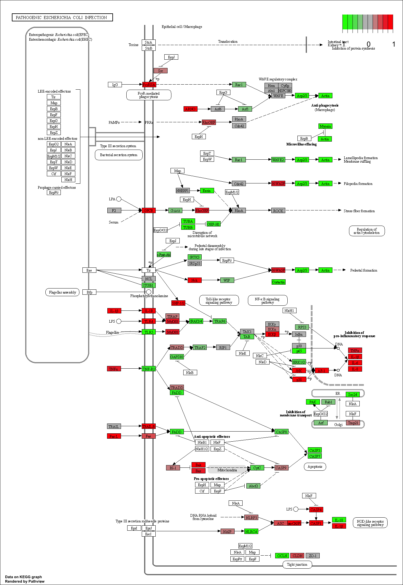

Class 13: Pathway Analysis from RNA-Seq Results
================
Elena

- <a href="#background" id="toc-background">Background</a>
- <a href="#read-countdata-and-coldata"
  id="toc-read-countdata-and-coldata">1. Read countData and colData</a>
- <a href="#fix-countdata" id="toc-fix-countdata">2. Fix countData</a>
  - <a href="#qc-with-pca" id="toc-qc-with-pca">QC with PCA</a>
- <a href="#deseq-analysis" id="toc-deseq-analysis">3. DESeq Analysis</a>
- <a href="#add-gene-annotation" id="toc-add-gene-annotation">4. Add Gene
  Annotation</a>
- <a href="#pathway-analysis" id="toc-pathway-analysis">5. Pathway
  Analysis</a>
  - <a href="#go-analysis" id="toc-go-analysis">GO Analysis</a>
  - <a href="#reactome" id="toc-reactome">Reactome</a>

# Background

- Read countData and colData

- Check and fix countData if required

- DESeq Analysis

- Visualization

- Gene Annotation

- Pathway Analysis

The data for for hands-on session comes from GEO entry: GSE37704, which
is associated with the following publication:

> Trapnell C, Hendrickson DG, Sauvageau M, Goff L et al. “Differential
> analysis of gene regulation at transcript resolution with RNA-seq”.
> Nat Biotechnol 2013 Jan;31(1):46-53. PMID: 23222703

# 1. Read countData and colData

``` r
colData <- read.csv("GSE37704_metadata.csv", row.names=1)
countData <- read.csv("GSE37704_featurecounts.csv", row.names=1)

head(colData)
```

                  condition
    SRR493366 control_sirna
    SRR493367 control_sirna
    SRR493368 control_sirna
    SRR493369      hoxa1_kd
    SRR493370      hoxa1_kd
    SRR493371      hoxa1_kd

``` r
head(countData)
```

                    length SRR493366 SRR493367 SRR493368 SRR493369 SRR493370
    ENSG00000186092    918         0         0         0         0         0
    ENSG00000279928    718         0         0         0         0         0
    ENSG00000279457   1982        23        28        29        29        28
    ENSG00000278566    939         0         0         0         0         0
    ENSG00000273547    939         0         0         0         0         0
    ENSG00000187634   3214       124       123       205       207       212
                    SRR493371
    ENSG00000186092         0
    ENSG00000279928         0
    ENSG00000279457        46
    ENSG00000278566         0
    ENSG00000273547         0
    ENSG00000187634       258

# 2. Fix countData

``` r
#Get rid of length column in countData
countData <- countData[,-1]
head(countData)
```

                    SRR493366 SRR493367 SRR493368 SRR493369 SRR493370 SRR493371
    ENSG00000186092         0         0         0         0         0         0
    ENSG00000279928         0         0         0         0         0         0
    ENSG00000279457        23        28        29        29        28        46
    ENSG00000278566         0         0         0         0         0         0
    ENSG00000273547         0         0         0         0         0         0
    ENSG00000187634       124       123       205       207       212       258

Make sure the colData column names matches the countData row names:

``` r
all(rownames(colData) == colnames(countData))
```

    [1] TRUE

Looks good, apart from the 0 count genes. Remove:

``` r
keep.inds <- rowSums(countData) != 0 #Get indices that do not equal 0
counts <- countData[keep.inds,] #Keep only indices that do not equal 0
head(counts)
```

                    SRR493366 SRR493367 SRR493368 SRR493369 SRR493370 SRR493371
    ENSG00000279457        23        28        29        29        28        46
    ENSG00000187634       124       123       205       207       212       258
    ENSG00000188976      1637      1831      2383      1226      1326      1504
    ENSG00000187961       120       153       180       236       255       357
    ENSG00000187583        24        48        65        44        48        64
    ENSG00000187642         4         9        16        14        16        16

``` r
nrow(counts)
```

    [1] 15975

## QC with PCA

The `prcomp()` function in base R is often used to check:

``` r
pca <- prcomp(t(counts),scale=T)
summary(pca)
```

    Importance of components:
                               PC1     PC2      PC3      PC4      PC5       PC6
    Standard deviation     87.7211 73.3196 32.89604 31.15094 29.18417 6.648e-13
    Proportion of Variance  0.4817  0.3365  0.06774  0.06074  0.05332 0.000e+00
    Cumulative Proportion   0.4817  0.8182  0.88594  0.94668  1.00000 1.000e+00

``` r
plot(pca$x[,1], pca$x[,2], col=as.factor(colData$condition), pch=16)
```


The major variance in this dataset is consistent with different
condition.

# 3. DESeq Analysis

``` r
library(DESeq2)
```

``` r
dds <- DESeqDataSetFromMatrix(countData = counts,
                              colData = colData,
                              design = ~condition,)
```

    Warning in DESeqDataSet(se, design = design, ignoreRank): some variables in
    design formula are characters, converting to factors

``` r
dds <- DESeq(dds)
```

    estimating size factors

    estimating dispersions

    gene-wise dispersion estimates

    mean-dispersion relationship

    final dispersion estimates

    fitting model and testing

``` r
res <- results(dds)
head(res)
```

    log2 fold change (MLE): condition hoxa1 kd vs control sirna 
    Wald test p-value: condition hoxa1 kd vs control sirna 
    DataFrame with 6 rows and 6 columns
                     baseMean log2FoldChange     lfcSE       stat      pvalue
                    <numeric>      <numeric> <numeric>  <numeric>   <numeric>
    ENSG00000279457   29.9136      0.1792571 0.3248216   0.551863 5.81042e-01
    ENSG00000187634  183.2296      0.4264571 0.1402658   3.040350 2.36304e-03
    ENSG00000188976 1651.1881     -0.6927205 0.0548465 -12.630158 1.43990e-36
    ENSG00000187961  209.6379      0.7297556 0.1318599   5.534326 3.12428e-08
    ENSG00000187583   47.2551      0.0405765 0.2718928   0.149237 8.81366e-01
    ENSG00000187642   11.9798      0.5428105 0.5215598   1.040744 2.97994e-01
                           padj
                      <numeric>
    ENSG00000279457 6.86555e-01
    ENSG00000187634 5.15718e-03
    ENSG00000188976 1.76549e-35
    ENSG00000187961 1.13413e-07
    ENSG00000187583 9.19031e-01
    ENSG00000187642 4.03379e-01

``` r
summary(res)
```


    out of 15975 with nonzero total read count
    adjusted p-value < 0.1
    LFC > 0 (up)       : 4349, 27%
    LFC < 0 (down)     : 4396, 28%
    outliers [1]       : 0, 0%
    low counts [2]     : 1237, 7.7%
    (mean count < 0)
    [1] see 'cooksCutoff' argument of ?results
    [2] see 'independentFiltering' argument of ?results

``` r
#Colour vector for all genes
mycols <- rep("gray", nrow(counts))
#If log2FC > 2 or < -2, colour blue; if padj > 0.05, colour grey
mycols[res$log2FoldChange > 2] <- "blue"
mycols[res$log2FoldChange < -2] <- "blue"
mycols[res$padj > 0.05] <- "grey"

plot(res$log2FoldChange, -log(res$padj), col=mycols)
abline(v=c(-2,+2))
```


# 4. Add Gene Annotation

``` r
library(AnnotationDbi)
library(org.Hs.eg.db)
columns(org.Hs.eg.db)
```

     [1] "ACCNUM"       "ALIAS"        "ENSEMBL"      "ENSEMBLPROT"  "ENSEMBLTRANS"
     [6] "ENTREZID"     "ENZYME"       "EVIDENCE"     "EVIDENCEALL"  "GENENAME"    
    [11] "GENETYPE"     "GO"           "GOALL"        "IPI"          "MAP"         
    [16] "OMIM"         "ONTOLOGY"     "ONTOLOGYALL"  "PATH"         "PFAM"        
    [21] "PMID"         "PROSITE"      "REFSEQ"       "SYMBOL"       "UCSCKG"      
    [26] "UNIPROT"     

Use `mapIDs()` to add SYMBOL and ENTREZID annotation to our results.

``` r
res$symbol <- mapIds(org.Hs.eg.db,
                     keys = rownames(counts),
                     keytype = "ENSEMBL",
                     column = "SYMBOL",
                     multiVals = "first")
```

    'select()' returned 1:many mapping between keys and columns

``` r
head(res)
```

    log2 fold change (MLE): condition hoxa1 kd vs control sirna 
    Wald test p-value: condition hoxa1 kd vs control sirna 
    DataFrame with 6 rows and 7 columns
                     baseMean log2FoldChange     lfcSE       stat      pvalue
                    <numeric>      <numeric> <numeric>  <numeric>   <numeric>
    ENSG00000279457   29.9136      0.1792571 0.3248216   0.551863 5.81042e-01
    ENSG00000187634  183.2296      0.4264571 0.1402658   3.040350 2.36304e-03
    ENSG00000188976 1651.1881     -0.6927205 0.0548465 -12.630158 1.43990e-36
    ENSG00000187961  209.6379      0.7297556 0.1318599   5.534326 3.12428e-08
    ENSG00000187583   47.2551      0.0405765 0.2718928   0.149237 8.81366e-01
    ENSG00000187642   11.9798      0.5428105 0.5215598   1.040744 2.97994e-01
                           padj      symbol
                      <numeric> <character>
    ENSG00000279457 6.86555e-01          NA
    ENSG00000187634 5.15718e-03      SAMD11
    ENSG00000188976 1.76549e-35       NOC2L
    ENSG00000187961 1.13413e-07      KLHL17
    ENSG00000187583 9.19031e-01     PLEKHN1
    ENSG00000187642 4.03379e-01       PERM1

``` r
res$entrez <- mapIds(org.Hs.eg.db,
                     keys = rownames(counts),
                     keytype = "ENSEMBL",
                     column = "ENTREZID",
                     multiVals="first")
```

    'select()' returned 1:many mapping between keys and columns

``` r
head(res)
```

    log2 fold change (MLE): condition hoxa1 kd vs control sirna 
    Wald test p-value: condition hoxa1 kd vs control sirna 
    DataFrame with 6 rows and 8 columns
                     baseMean log2FoldChange     lfcSE       stat      pvalue
                    <numeric>      <numeric> <numeric>  <numeric>   <numeric>
    ENSG00000279457   29.9136      0.1792571 0.3248216   0.551863 5.81042e-01
    ENSG00000187634  183.2296      0.4264571 0.1402658   3.040350 2.36304e-03
    ENSG00000188976 1651.1881     -0.6927205 0.0548465 -12.630158 1.43990e-36
    ENSG00000187961  209.6379      0.7297556 0.1318599   5.534326 3.12428e-08
    ENSG00000187583   47.2551      0.0405765 0.2718928   0.149237 8.81366e-01
    ENSG00000187642   11.9798      0.5428105 0.5215598   1.040744 2.97994e-01
                           padj      symbol      entrez
                      <numeric> <character> <character>
    ENSG00000279457 6.86555e-01          NA          NA
    ENSG00000187634 5.15718e-03      SAMD11      148398
    ENSG00000188976 1.76549e-35       NOC2L       26155
    ENSG00000187961 1.13413e-07      KLHL17      339451
    ENSG00000187583 9.19031e-01     PLEKHN1       84069
    ENSG00000187642 4.03379e-01       PERM1       84808

``` r
res$genenames <- mapIds(org.Hs.eg.db,
                     keys = rownames(counts),
                     keytype = "ENSEMBL",
                     column = "GENENAME",
                     multiVals="first")
```

    'select()' returned 1:many mapping between keys and columns

``` r
head(res)
```

    log2 fold change (MLE): condition hoxa1 kd vs control sirna 
    Wald test p-value: condition hoxa1 kd vs control sirna 
    DataFrame with 6 rows and 9 columns
                     baseMean log2FoldChange     lfcSE       stat      pvalue
                    <numeric>      <numeric> <numeric>  <numeric>   <numeric>
    ENSG00000279457   29.9136      0.1792571 0.3248216   0.551863 5.81042e-01
    ENSG00000187634  183.2296      0.4264571 0.1402658   3.040350 2.36304e-03
    ENSG00000188976 1651.1881     -0.6927205 0.0548465 -12.630158 1.43990e-36
    ENSG00000187961  209.6379      0.7297556 0.1318599   5.534326 3.12428e-08
    ENSG00000187583   47.2551      0.0405765 0.2718928   0.149237 8.81366e-01
    ENSG00000187642   11.9798      0.5428105 0.5215598   1.040744 2.97994e-01
                           padj      symbol      entrez              genenames
                      <numeric> <character> <character>            <character>
    ENSG00000279457 6.86555e-01          NA          NA                     NA
    ENSG00000187634 5.15718e-03      SAMD11      148398 sterile alpha motif ..
    ENSG00000188976 1.76549e-35       NOC2L       26155 NOC2 like nucleolar ..
    ENSG00000187961 1.13413e-07      KLHL17      339451 kelch like family me..
    ENSG00000187583 9.19031e-01     PLEKHN1       84069 pleckstrin homology ..
    ENSG00000187642 4.03379e-01       PERM1       84808 PPARGC1 and ESRR ind..

``` r
res = res[order(res$pvalue),]
write.csv(res, file="deseq_results.csv")
```

# 5. Pathway Analysis

We can use `gage()` with KEGG and GO.

``` r
library(gage)
library(gageData)
library(pathview)
```

What `gage()` wants as input is that vector of importance - in our case,
that will be the log2 FC values. This vector should have `names()` that
are ENTREZ IDs.

``` r
foldchange <- res$log2FoldChange
names(foldchange) <- res$entrez
head(foldchange)
```

         1266     54855      1465     51232      2034      2317 
    -2.422719  3.201955 -2.313738 -2.059631 -1.888019 -1.649792 

``` r
data(kegg.sets.hs)
data(sigmet.idx.hs)

keggres = gage(foldchange, gsets=kegg.sets.hs)
```

``` r
head(keggres$greater,5)
```

                                                       p.geomean stat.mean
    hsa04060 Cytokine-cytokine receptor interaction 9.131044e-06  4.358967
    hsa05323 Rheumatoid arthritis                   1.809824e-04  3.666793
    hsa05146 Amoebiasis                             1.313400e-03  3.052596
    hsa05332 Graft-versus-host disease              2.605234e-03  2.948229
    hsa04640 Hematopoietic cell lineage             2.822776e-03  2.833362
                                                           p.val       q.val
    hsa04060 Cytokine-cytokine receptor interaction 9.131044e-06 0.001917519
    hsa05323 Rheumatoid arthritis                   1.809824e-04 0.019003147
    hsa05146 Amoebiasis                             1.313400e-03 0.091937999
    hsa05332 Graft-versus-host disease              2.605234e-03 0.118556573
    hsa04640 Hematopoietic cell lineage             2.822776e-03 0.118556573
                                                    set.size         exp1
    hsa04060 Cytokine-cytokine receptor interaction      177 9.131044e-06
    hsa05323 Rheumatoid arthritis                         72 1.809824e-04
    hsa05146 Amoebiasis                                   94 1.313400e-03
    hsa05332 Graft-versus-host disease                    22 2.605234e-03
    hsa04640 Hematopoietic cell lineage                   55 2.822776e-03

``` r
head(keggres$less,5)
```

                                                      p.geomean stat.mean
    hsa04110 Cell cycle                            8.995727e-06 -4.378644
    hsa03030 DNA replication                       9.424076e-05 -3.951803
    hsa05130 Pathogenic Escherichia coli infection 1.405864e-04 -3.765330
    hsa03013 RNA transport                         1.375901e-03 -3.028500
    hsa03440 Homologous recombination              3.066756e-03 -2.852899
                                                          p.val       q.val
    hsa04110 Cell cycle                            8.995727e-06 0.001889103
    hsa03030 DNA replication                       9.424076e-05 0.009841047
    hsa05130 Pathogenic Escherichia coli infection 1.405864e-04 0.009841047
    hsa03013 RNA transport                         1.375901e-03 0.072234819
    hsa03440 Homologous recombination              3.066756e-03 0.128803765
                                                   set.size         exp1
    hsa04110 Cell cycle                                 121 8.995727e-06
    hsa03030 DNA replication                             36 9.424076e-05
    hsa05130 Pathogenic Escherichia coli infection       53 1.405864e-04
    hsa03013 RNA transport                              144 1.375901e-03
    hsa03440 Homologous recombination                    28 3.066756e-03

``` r
pathview(gene.data=foldchange, pathway.id="hsa04110")
```


Top 5 downregulated pathways:

``` r
keggrespathwaysless5 <- rownames(keggres$less)[1:5]

# Extract the 8 character long IDs part of each string
keggresids = substr(keggrespathwaysless5, start=1, stop=8)
keggresids
```

    [1] "hsa04110" "hsa03030" "hsa05130" "hsa03013" "hsa03440"

``` r
pathview(gene.data=foldchange, pathway.id=keggresids, species="hsa")
```





## GO Analysis

``` r
data(go.sets.hs)
data(go.subs.hs)

# Focus on Biological Process subset of GO
gobpsets = go.sets.hs[go.subs.hs$BP]

gobpres = gage(foldchange, gsets=gobpsets, same.dir=TRUE)

lapply(gobpres, head)
```

    $greater
                                                 p.geomean stat.mean        p.val
    GO:0007156 homophilic cell adhesion       8.519724e-05  3.824205 8.519724e-05
    GO:0002009 morphogenesis of an epithelium 1.396681e-04  3.653886 1.396681e-04
    GO:0048729 tissue morphogenesis           1.432451e-04  3.643242 1.432451e-04
    GO:0007610 behavior                       2.195494e-04  3.530241 2.195494e-04
    GO:0060562 epithelial tube morphogenesis  5.932837e-04  3.261376 5.932837e-04
    GO:0035295 tube development               5.953254e-04  3.253665 5.953254e-04
                                                  q.val set.size         exp1
    GO:0007156 homophilic cell adhesion       0.1951953      113 8.519724e-05
    GO:0002009 morphogenesis of an epithelium 0.1951953      339 1.396681e-04
    GO:0048729 tissue morphogenesis           0.1951953      424 1.432451e-04
    GO:0007610 behavior                       0.2243795      427 2.195494e-04
    GO:0060562 epithelial tube morphogenesis  0.3711390      257 5.932837e-04
    GO:0035295 tube development               0.3711390      391 5.953254e-04

    $less
                                                p.geomean stat.mean        p.val
    GO:0048285 organelle fission             1.536227e-15 -8.063910 1.536227e-15
    GO:0000280 nuclear division              4.286961e-15 -7.939217 4.286961e-15
    GO:0007067 mitosis                       4.286961e-15 -7.939217 4.286961e-15
    GO:0000087 M phase of mitotic cell cycle 1.169934e-14 -7.797496 1.169934e-14
    GO:0007059 chromosome segregation        2.028624e-11 -6.878340 2.028624e-11
    GO:0000236 mitotic prometaphase          1.729553e-10 -6.695966 1.729553e-10
                                                    q.val set.size         exp1
    GO:0048285 organelle fission             5.841698e-12      376 1.536227e-15
    GO:0000280 nuclear division              5.841698e-12      352 4.286961e-15
    GO:0007067 mitosis                       5.841698e-12      352 4.286961e-15
    GO:0000087 M phase of mitotic cell cycle 1.195672e-11      362 1.169934e-14
    GO:0007059 chromosome segregation        1.658603e-08      142 2.028624e-11
    GO:0000236 mitotic prometaphase          1.178402e-07       84 1.729553e-10

    $stats
                                              stat.mean     exp1
    GO:0007156 homophilic cell adhesion        3.824205 3.824205
    GO:0002009 morphogenesis of an epithelium  3.653886 3.653886
    GO:0048729 tissue morphogenesis            3.643242 3.643242
    GO:0007610 behavior                        3.530241 3.530241
    GO:0060562 epithelial tube morphogenesis   3.261376 3.261376
    GO:0035295 tube development                3.253665 3.253665

## Reactome

We can use the online version

``` r
sig_genes <- res[res$padj <= 0.05 & !is.na(res$padj), "symbol"]
print(paste("Total number of significant genes:", length(sig_genes)))
```

    [1] "Total number of significant genes: 8147"

``` r
write.table(sig_genes, file="significant_genes.txt", row.names=FALSE, col.names=FALSE, quote=FALSE)
```

What pathway has the most significant “Entities p-value”?

- Endosomal/vacuolar pathway
- Antigen presentation (MHC class I)
- Cell cycle, Mitotic
- Mitotic spindle checkpoint
- etc.

Do the most significant pathways listed match your previous KEGG
results?

- For the most part, seems to match the downregulated KEGG pathways. Not
  so much the upregulated KEGG pathways.

What factors could cause differences between the two methods?

- Perhaps different annotations for genes, or different categorizations.
