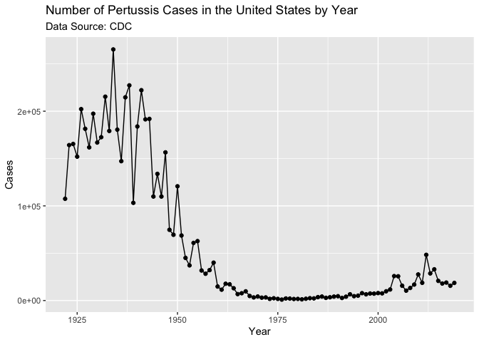
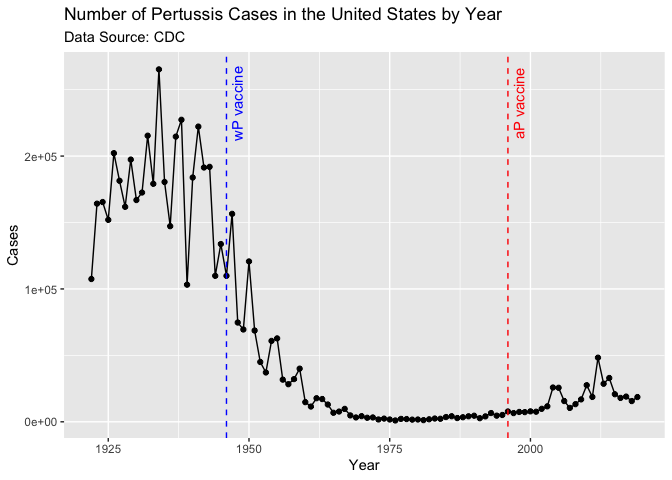
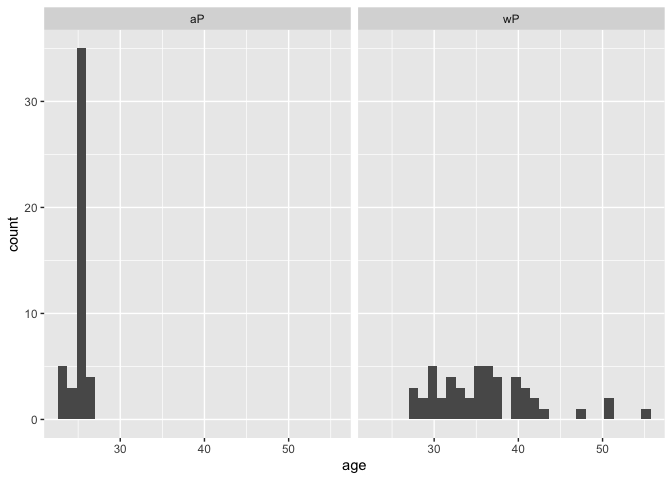
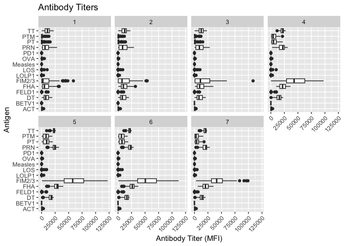
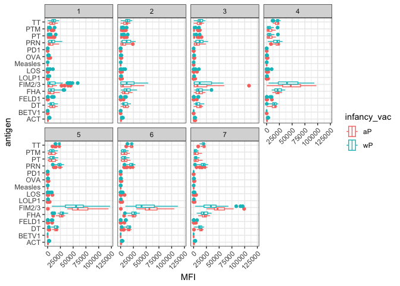
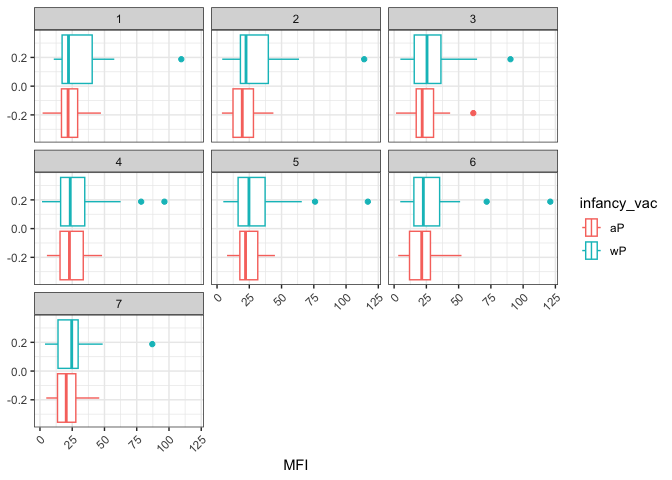
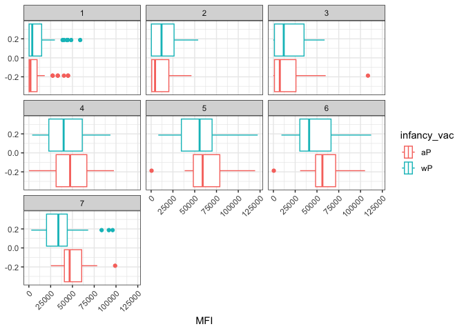

Class 19: Pertussis Project
================
Elena

- <a href="#investigating-pertussis-cases-by-year"
  id="toc-investigating-pertussis-cases-by-year">Investigating Pertussis
  Cases by Year</a>
  - <a
    href="#q1.-with-the-help-of-the-r-addin-package-datapasta-assign-the-cdc-pertussis-case-number-data-to-a-data-frame-called-cdc-and-use-ggplot-to-make-a-plot-of-cases-numbers-over-time."
    id="toc-q1.-with-the-help-of-the-r-addin-package-datapasta-assign-the-cdc-pertussis-case-number-data-to-a-data-frame-called-cdc-and-use-ggplot-to-make-a-plot-of-cases-numbers-over-time.">Q1.
    With the help of the R “addin” package datapasta assign the CDC
    pertussis case number data to a data frame called cdc and use ggplot to
    make a plot of cases numbers over time.</a>
- <a href="#vaccines" id="toc-vaccines">Vaccines</a>
  - <a
    href="#q2.-using-the-ggplot-geom_vline-function-add-lines-to-your-previous-plot-for-the-1946-introduction-of-the-wp-vaccine-and-the-1996-switch-to-ap-vaccine-see-example-in-the-hint-below.-what-do-you-notice"
    id="toc-q2.-using-the-ggplot-geom_vline-function-add-lines-to-your-previous-plot-for-the-1946-introduction-of-the-wp-vaccine-and-the-1996-switch-to-ap-vaccine-see-example-in-the-hint-below.-what-do-you-notice">Q2.
    Using the ggplot geom_vline() function add lines to your previous plot
    for the 1946 introduction of the wP vaccine and the 1996 switch to aP
    vaccine (see example in the hint below). What do you notice?</a>
  - <a
    href="#q3.-describe-what-happened-after-the-introduction-of-the-ap-vaccine-do-you-have-a-possible-explanation-for-the-observed-trend"
    id="toc-q3.-describe-what-happened-after-the-introduction-of-the-ap-vaccine-do-you-have-a-possible-explanation-for-the-observed-trend">Q3.
    Describe what happened after the introduction of the aP vaccine? Do you
    have a possible explanation for the observed trend?</a>
- <a href="#exploring-cmi-pb-data"
  id="toc-exploring-cmi-pb-data">Exploring CMI-PB Data</a>
  - <a
    href="#q4.-how-many-ap-and-wp-infancy-vaccinated-subjects-are-in-the-dataset"
    id="toc-q4.-how-many-ap-and-wp-infancy-vaccinated-subjects-are-in-the-dataset">Q4.
    How many aP and wP infancy vaccinated subjects are in the dataset?</a>
  - <a
    href="#q5.-how-many-male-and-female-subjectspatients-are-in-the-dataset"
    id="toc-q5.-how-many-male-and-female-subjectspatients-are-in-the-dataset">Q5.
    How many Male and Female subjects/patients are in the dataset?</a>
  - <a
    href="#q6.-what-is-the-breakdown-of-race-and-biological-sex-e.g.-number-of-asian-females-white-males-etc"
    id="toc-q6.-what-is-the-breakdown-of-race-and-biological-sex-e.g.-number-of-asian-females-white-males-etc">Q6.
    What is the breakdown of race and biological sex (e.g. number of Asian
    females, White males etc…)?</a>
  - <a
    href="#q7.-using-this-approach-determine-i-the-average-age-of-wp-individuals-ii-the-average-age-of-ap-individuals-and-iii-are-they-significantly-different"
    id="toc-q7.-using-this-approach-determine-i-the-average-age-of-wp-individuals-ii-the-average-age-of-ap-individuals-and-iii-are-they-significantly-different">Q7.
    Using this approach determine (i) the average age of wP individuals,
    (ii) the average age of aP individuals; and (iii) are they significantly
    different?</a>
  - <a href="#q8.-determine-the-age-of-all-individuals-at-time-of-boost"
    id="toc-q8.-determine-the-age-of-all-individuals-at-time-of-boost">Q8.
    Determine the age of all individuals at time of boost?</a>
  - <a
    href="#q9.-with-the-help-of-a-faceted-boxplot-or-histogram-see-below-do-you-think-these-two-groups-are-significantly-different"
    id="toc-q9.-with-the-help-of-a-faceted-boxplot-or-histogram-see-below-do-you-think-these-two-groups-are-significantly-different">Q9.
    With the help of a faceted boxplot or histogram (see below), do you
    think these two groups are significantly different?</a>
  - <a
    href="#q10.-complete-the-code-to-join-specimen-and-subject-tables-to-make-a-new-merged-data-frame-containing-all-specimen-records-along-with-their-associated-subject-details"
    id="toc-q10.-complete-the-code-to-join-specimen-and-subject-tables-to-make-a-new-merged-data-frame-containing-all-specimen-records-along-with-their-associated-subject-details">Q10.
    Complete the code to join specimen and subject tables to make a new
    merged data frame containing all specimen records along with their
    associated subject details:</a>
  - <a
    href="#q11.-now-using-the-same-procedure-join-meta-with-titer-data-so-we-can-further-analyze-this-data-in-terms-of-time-of-visit-apwp-malefemale-etc."
    id="toc-q11.-now-using-the-same-procedure-join-meta-with-titer-data-so-we-can-further-analyze-this-data-in-terms-of-time-of-visit-apwp-malefemale-etc.">Q11.
    Now using the same procedure join meta with titer data so we can further
    analyze this data in terms of time of visit aP/wP, male/female etc.</a>
  - <a
    href="#q12.-how-many-specimens-i.e.-entries-in-abdata-do-we-have-for-each-isotype"
    id="toc-q12.-how-many-specimens-i.e.-entries-in-abdata-do-we-have-for-each-isotype">Q12.
    How many specimens (i.e. entries in abdata) do we have for each
    isotype?</a>
  - <a
    href="#q13.-what-do-you-notice-about-the-number-of-visit-8-specimens-compared-to-other-visits"
    id="toc-q13.-what-do-you-notice-about-the-number-of-visit-8-specimens-compared-to-other-visits">Q13.
    What do you notice about the number of visit 8 specimens compared to
    other visits?</a>
- <a href="#examine-igg1-ab-titer-levels"
  id="toc-examine-igg1-ab-titer-levels">Examine IgG1 Ab titer levels</a>
  - <a
    href="#q14.-complete-the-following-code-to-make-a-summary-boxplot-of-ab-titer-levels-for-all-antigens"
    id="toc-q14.-complete-the-following-code-to-make-a-summary-boxplot-of-ab-titer-levels-for-all-antigens">Q14.
    Complete the following code to make a summary boxplot of Ab titer levels
    for all antigens:</a>
  - <a
    href="#q15.-what-antigens-show-differences-in-the-level-of-igg1-antibody-titers-recognizing-them-over-time-why-these-and-not-others"
    id="toc-q15.-what-antigens-show-differences-in-the-level-of-igg1-antibody-titers-recognizing-them-over-time-why-these-and-not-others">Q15.
    What antigens show differences in the level of IgG1 antibody titers
    recognizing them over time? Why these and not others?</a>
  - <a
    href="#q16.-filter-to-pull-out-only-two-specific-antigens-for-analysis-and-create-a-boxplot-for-each.-you-can-chose-any-you-like.-below-i-picked-a-control-antigen-measles-that-is-not-in-our-vaccines-and-a-clear-antigen-of-interest-fim23-extra-cellular-fimbriae-proteins-from-b.-pertussis-that-participate-in-substrate-attachment."
    id="toc-q16.-filter-to-pull-out-only-two-specific-antigens-for-analysis-and-create-a-boxplot-for-each.-you-can-chose-any-you-like.-below-i-picked-a-control-antigen-measles-that-is-not-in-our-vaccines-and-a-clear-antigen-of-interest-fim23-extra-cellular-fimbriae-proteins-from-b.-pertussis-that-participate-in-substrate-attachment.">Q16.
    Filter to pull out only two specific antigens for analysis and create a
    boxplot for each. You can chose any you like. Below I picked a “control”
    antigen (“Measles”, that is not in our vaccines) and a clear antigen of
    interest (“FIM2/3”, extra-cellular fimbriae proteins from B. pertussis
    that participate in substrate attachment).</a>
  - <a
    href="#q17.-what-do-you-notice-about-these-two-antigens-time-courses-and-the-fim23-data-in-particular"
    id="toc-q17.-what-do-you-notice-about-these-two-antigens-time-courses-and-the-fim23-data-in-particular">Q17.
    What do you notice about these two antigens time courses and the FIM2/3
    data in particular?</a>
  - <a href="#q18.-do-you-see-any-clear-difference-in-ap-vs.-wp-responses"
    id="toc-q18.-do-you-see-any-clear-difference-in-ap-vs.-wp-responses">Q18.
    Do you see any clear difference in aP vs. wP responses?</a>
- <a href="#obtaining-cmi-pb-rnaseq-data"
  id="toc-obtaining-cmi-pb-rnaseq-data">Obtaining CMI-PB RNASeq data</a>
  - <a
    href="#q19.-make-a-plot-of-the-time-course-of-gene-expression-for-ighg1-gene-i.e.-a-plot-of-visit-vs.-tpm"
    id="toc-q19.-make-a-plot-of-the-time-course-of-gene-expression-for-ighg1-gene-i.e.-a-plot-of-visit-vs.-tpm">Q19.
    Make a plot of the time course of gene expression for IGHG1 gene (i.e. a
    plot of visit vs. tpm)</a>
  - <a
    href="#q19.-what-do-you-notice-about-the-expression-of-this-gene-i.e.-when-is-it-at-its-maximum-level"
    id="toc-q19.-what-do-you-notice-about-the-expression-of-this-gene-i.e.-when-is-it-at-its-maximum-level">Q19.
    What do you notice about the expression of this gene (i.e. when is it at
    it’s maximum level)?</a>
  - <a
    href="#q20.-does-this-pattern-in-time-match-the-trend-of-antibody-titer-data-if-not-why-not"
    id="toc-q20.-does-this-pattern-in-time-match-the-trend-of-antibody-titer-data-if-not-why-not">Q20.
    Does this pattern in time match the trend of antibody titer data? If
    not, why not?</a>

# Investigating Pertussis Cases by Year

``` r
#install.packages("datapasta")
library(ggplot2)
```

To use the package, don’t need to call in Library. Go to Addins in the
top ribbon.

Highlight and copy data from:
https://www.cdc.gov/pertussis/surv-reporting/cases-by-year.html. To
paste, go to Addins \> Paste as data.frame in R code chunk.

## Q1. With the help of the R “addin” package datapasta assign the CDC pertussis case number data to a data frame called cdc and use ggplot to make a plot of cases numbers over time.

``` r
 cdc <- data.frame(
                                  Year = c(1922L,1923L,1924L,1925L,
                                           1926L,1927L,1928L,1929L,1930L,
                                           1931L,1932L,1933L,1934L,1935L,
                                           1936L,1937L,1938L,1939L,1940L,1941L,
                                           1942L,1943L,1944L,1945L,1946L,
                                           1947L,1948L,1949L,1950L,1951L,
                                           1952L,1953L,1954L,1955L,1956L,1957L,
                                           1958L,1959L,1960L,1961L,1962L,
                                           1963L,1964L,1965L,1966L,1967L,
                                           1968L,1969L,1970L,1971L,1972L,
                                           1973L,1974L,1975L,1976L,1977L,1978L,
                                           1979L,1980L,1981L,1982L,1983L,
                                           1984L,1985L,1986L,1987L,1988L,
                                           1989L,1990L,1991L,1992L,1993L,1994L,
                                           1995L,1996L,1997L,1998L,1999L,
                                           2000L,2001L,2002L,2003L,2004L,
                                           2005L,2006L,2007L,2008L,2009L,
                                           2010L,2011L,2012L,2013L,2014L,2015L,
                                           2016L,2017L,2018L,2019L),
          Cases = c(107473,164191,165418,
                                           152003,202210,181411,161799,197371,
                                           166914,172559,215343,179135,265269,
                                           180518,147237,214652,227319,
                                           103188,183866,222202,191383,191890,
                                           109873,133792,109860,156517,74715,
                                           69479,120718,68687,45030,37129,
                                           60886,62786,31732,28295,32148,
                                           40005,14809,11468,17749,17135,
                                           13005,6799,7717,9718,4810,3285,
                                           4249,3036,3287,1759,2402,1738,1010,
                                           2177,2063,1623,1730,1248,1895,
                                           2463,2276,3589,4195,2823,3450,
                                           4157,4570,2719,4083,6586,4617,
                                           5137,7796,6564,7405,7298,7867,
                                           7580,9771,11647,25827,25616,15632,
                                           10454,13278,16858,27550,18719,
                                           48277,28639,32971,20762,17972,
                                           18975,15609,18617)
        )
```

``` r
baseplot <- ggplot(cdc) + 
  aes(x=Year,y=Cases) + 
  geom_point() + geom_line() +
  labs(title="Number of Pertussis Cases in the United States by Year", subtitle="Data Source: CDC")
baseplot
```



# Vaccines

## Q2. Using the ggplot geom_vline() function add lines to your previous plot for the 1946 introduction of the wP vaccine and the 1996 switch to aP vaccine (see example in the hint below). What do you notice?

``` r
baseplot +
  geom_vline(xintercept=c(1946,1996), lty="dashed", col=c("blue","red")) +
  annotate("text", x=1948, y=240000, label="wP vaccine",angle=90, col="blue") +
  annotate("text", x=1998, y=240000, label="aP vaccine",angle=90, col="red")
```



## Q3. Describe what happened after the introduction of the aP vaccine? Do you have a possible explanation for the observed trend?

After the introduction of the aP vaccine, there is a rise in pertussis
cases after a few years.

Possible explanations include:

- Publication of the now-debunked 1998 Wakefield study that erroneously
  claimed that vaccines cause autism. This led to an increase in
  anti-vaccine sentiment

- Vaccine formula not as effective as the original wP vaccine

- Decrease in vaccination and/or public health push for vaccination due
  to decrease in infections

- Reduction in immunity since the wP vaccine

- Bias and limitation in vaccine trials (study subjects, limited time,
  limited funding, etc.)

- Increase in bacterial mutations (less likely…there needs to be an
  evolutionary selection force, which is not immediately clear)

# Exploring CMI-PB Data

``` r
#install.packages("jsonlite")
library(jsonlite)
subject <- read_json("https://www.cmi-pb.org/api/subject", simplifyVector = TRUE)
head(subject, 3)
```

      subject_id infancy_vac biological_sex              ethnicity  race
    1          1          wP         Female Not Hispanic or Latino White
    2          2          wP         Female Not Hispanic or Latino White
    3          3          wP         Female                Unknown White
      year_of_birth date_of_boost      dataset
    1    1986-01-01    2016-09-12 2020_dataset
    2    1968-01-01    2019-01-28 2020_dataset
    3    1983-01-01    2016-10-10 2020_dataset

## Q4. How many aP and wP infancy vaccinated subjects are in the dataset?

47 aP and 49 wP subjects.

``` r
table(subject$infancy_vac)
```


    aP wP 
    47 49 

## Q5. How many Male and Female subjects/patients are in the dataset?

66 female and 30 male.

``` r
table(subject$biological_sex)
```


    Female   Male 
        66     30 

## Q6. What is the breakdown of race and biological sex (e.g. number of Asian females, White males etc…)?

- American Indian/Alaska Native: 0F, 1M

- Asian: 18F, 9M

- Black or African American: 2F, 0M

- Native Hawaiian or Other Pacific Islander: 1F, 1M

- White: 27F, 13M

- More Than One Race: 8F, 2M

- Unknown or Not Reported: 10F, 4M

``` r
table(subject$race, subject$biological_sex)
```

                                               
                                                Female Male
      American Indian/Alaska Native                  0    1
      Asian                                         18    9
      Black or African American                      2    0
      More Than One Race                             8    2
      Native Hawaiian or Other Pacific Islander      1    1
      Unknown or Not Reported                       10    4
      White                                         27   13

## Q7. Using this approach determine (i) the average age of wP individuals, (ii) the average age of aP individuals; and (iii) are they significantly different?

1)  36.07532

2)  25.23087

3)  Yes; p-value \< 2.2e-16.

``` r
library(lubridate)
library(dplyr)
library(tidyverse)
today()
```

    [1] "2022-12-03"

Determining Average Age of wP Individuals

``` r
subject.wP <- subject %>%
  filter(infancy_vac=="wP")
head(subject.wP)
```

      subject_id infancy_vac biological_sex              ethnicity  race
    1          1          wP         Female Not Hispanic or Latino White
    2          2          wP         Female Not Hispanic or Latino White
    3          3          wP         Female                Unknown White
    4          4          wP           Male Not Hispanic or Latino Asian
    5          5          wP           Male Not Hispanic or Latino Asian
    6          6          wP         Female Not Hispanic or Latino White
      year_of_birth date_of_boost      dataset
    1    1986-01-01    2016-09-12 2020_dataset
    2    1968-01-01    2019-01-28 2020_dataset
    3    1983-01-01    2016-10-10 2020_dataset
    4    1988-01-01    2016-08-29 2020_dataset
    5    1991-01-01    2016-08-29 2020_dataset
    6    1988-01-01    2016-10-10 2020_dataset

``` r
subject.wP.age <- time_length( today() - ymd(subject.wP$year_of_birth),  "years")
subject.wP.age
```

     [1] 36.91992 54.92129 39.92060 34.92129 31.92060 34.92129 41.91923 37.91923
     [9] 40.91992 36.91992 40.91992 29.91923 33.91923 35.92060 42.92129 28.91992
    [17] 35.92060 29.91923 27.92060 29.91923 32.91992 46.92129 50.92129 50.92129
    [25] 32.91992 31.92060 27.92060 27.92060 34.92129 29.91923 35.92060 30.92129
    [33] 29.91923 41.91923 39.92060 37.91923 31.92060 30.92129 34.92129 39.92060
    [41] 40.91992 34.92129 33.91923 32.91992 39.92060 31.92060 37.91923 28.91992
    [49] 37.91923

``` r
mean(subject.wP.age)
```

    [1] 36.08353

Determining Average Age of aP Individuals

``` r
subject.aP <- subject %>%
  filter(infancy_vac=="aP")
head(subject.aP)
```

      subject_id infancy_vac biological_sex              ethnicity
    1          9          aP           Male Not Hispanic or Latino
    2         13          aP           Male Not Hispanic or Latino
    3         18          aP         Female     Hispanic or Latino
    4         70          aP           Male Not Hispanic or Latino
    5         71          aP         Female Not Hispanic or Latino
    6         75          aP         Female Not Hispanic or Latino
                                           race year_of_birth date_of_boost
    1                                     Asian    1996-01-01    2016-07-25
    2                                     White    1997-01-01    2016-07-25
    3                   Unknown or Not Reported    1997-01-01    2016-08-29
    4             American Indian/Alaska Native    1998-01-01    2019-01-28
    5                                     White    1998-01-01    2019-01-28
    6 Native Hawaiian or Other Pacific Islander    1998-01-01    2019-02-25
           dataset
    1 2020_dataset
    2 2020_dataset
    3 2020_dataset
    4 2021_dataset
    5 2021_dataset
    6 2021_dataset

``` r
subject.aP.age <- time_length( today() - ymd(subject.aP$year_of_birth),  "years")
subject.aP.age
```

     [1] 26.92129 25.91923 25.91923 24.91992 24.91992 24.91992 24.91992 24.91992
     [9] 23.92060 25.91923 22.92129 24.91992 22.92129 22.92129 25.91923 23.92060
    [17] 24.91992 22.92129 26.92129 23.92060 24.91992 22.92129 25.91923 25.91923
    [25] 25.91923 25.91923 24.91992 25.91923 25.91923 24.91992 24.91992 25.91923
    [33] 24.91992 26.92129 24.91992 25.91923 25.91923 25.91923 24.91992 24.91992
    [41] 25.91923 25.91923 25.91923 26.92129 25.91923 25.91923 25.91923

``` r
mean(subject.aP.age)
```

    [1] 25.23908

``` r
subject$age <- time_length( today() - ymd(subject$year_of_birth),  "years")
```

Statistical Significance

``` r
t.test(subject.wP.age,subject.aP.age)
```


        Welch Two Sample t-test

    data:  subject.wP.age and subject.aP.age
    t = 12.092, df = 51.082, p-value < 2.2e-16
    alternative hypothesis: true difference in means is not equal to 0
    95 percent confidence interval:
      9.044045 12.644857
    sample estimates:
    mean of x mean of y 
     36.08353  25.23908 

## Q8. Determine the age of all individuals at time of boost?

Average 25.60763 years old.

``` r
age.boost <- time_length( ymd(subject$date_of_boost) - ymd(subject$year_of_birth),  "years")
age.boost
```

     [1] 30.69678 51.07461 33.77413 28.65982 25.65914 28.77481 35.84942 34.14921
     [9] 20.56400 34.56263 30.65845 34.56263 19.56194 23.61944 27.61944 29.56331
    [17] 36.69815 19.65777 22.73511 32.26557 25.90007 23.90144 25.90007 28.91992
    [25] 42.92129 47.07461 47.07461 29.07324 21.07324 21.07324 28.15058 24.15058
    [33] 24.15058 21.14990 21.14990 31.20876 26.20671 32.20808 27.20876 26.20671
    [41] 21.20739 20.26557 22.26420 19.32375 21.32238 19.32375 19.32375 22.41752
    [49] 20.41889 21.41821 19.47707 23.47707 20.47639 21.47570 19.47707 35.65777
    [57] 33.65914 31.65777 25.73580 24.70089 28.70089 33.73580 19.73443 34.73511
    [65] 19.73443 28.73648 27.73443 19.81109 26.77344 33.81246 25.77413 19.81109
    [73] 18.85010 19.81109 31.81109 22.81177 31.84942 19.84942 18.85010 18.85010
    [81] 19.90691 18.85010 20.90897 19.04449 20.04381 19.90691 19.90691 19.00616
    [89] 19.00616 20.04381 20.04381 20.07940 21.08145 20.07940 20.07940 20.07940

``` r
mean(age.boost)
```

    [1] 25.60763

## Q9. With the help of a faceted boxplot or histogram (see below), do you think these two groups are significantly different?

Yes. Visually, those who have received the wP vaccine have a rather
large range of ages (late twenties to 50+), whereas those who received
the aP vaccine is only 20-30s. However, the data is biased because of
the difference in age range.

``` r
ggplot(subject) +
  aes(age) +
  geom_histogram() +
  facet_wrap(vars(infancy_vac))
```

    `stat_bin()` using `bins = 30`. Pick better value with `binwidth`.



## Q10. Complete the code to join specimen and subject tables to make a new merged data frame containing all specimen records along with their associated subject details:

``` r
specimen <- read_json("http://cmi-pb.org/api/specimen", simplifyVector = TRUE) 
titer <- read_json("http://cmi-pb.org/api/ab_titer", simplifyVector = TRUE) 
head(specimen)
```

      specimen_id subject_id actual_day_relative_to_boost
    1           1          1                           -3
    2           2          1                          736
    3           3          1                            1
    4           4          1                            3
    5           5          1                            7
    6           6          1                           11
      planned_day_relative_to_boost specimen_type visit
    1                             0         Blood     1
    2                           736         Blood    10
    3                             1         Blood     2
    4                             3         Blood     3
    5                             7         Blood     4
    6                            14         Blood     5

``` r
head(titer)
```

      specimen_id isotype is_antigen_specific antigen        MFI MFI_normalised
    1           1     IgE               FALSE   Total 1110.21154       2.493425
    2           1     IgE               FALSE   Total 2708.91616       2.493425
    3           1     IgG                TRUE      PT   68.56614       3.736992
    4           1     IgG                TRUE     PRN  332.12718       2.602350
    5           1     IgG                TRUE     FHA 1887.12263      34.050956
    6           1     IgE                TRUE     ACT    0.10000       1.000000
       unit lower_limit_of_detection
    1 UG/ML                 2.096133
    2 IU/ML                29.170000
    3 IU/ML                 0.530000
    4 IU/ML                 6.205949
    5 IU/ML                 4.679535
    6 IU/ML                 2.816431

Joining `subject` and `specimen` tables using the `*_join()` from DPLYR:

``` r
meta <- inner_join(specimen, subject)
```

    Joining, by = "subject_id"

``` r
dim(meta)
```

    [1] 729  14

``` r
head(meta)
```

      specimen_id subject_id actual_day_relative_to_boost
    1           1          1                           -3
    2           2          1                          736
    3           3          1                            1
    4           4          1                            3
    5           5          1                            7
    6           6          1                           11
      planned_day_relative_to_boost specimen_type visit infancy_vac biological_sex
    1                             0         Blood     1          wP         Female
    2                           736         Blood    10          wP         Female
    3                             1         Blood     2          wP         Female
    4                             3         Blood     3          wP         Female
    5                             7         Blood     4          wP         Female
    6                            14         Blood     5          wP         Female
                   ethnicity  race year_of_birth date_of_boost      dataset
    1 Not Hispanic or Latino White    1986-01-01    2016-09-12 2020_dataset
    2 Not Hispanic or Latino White    1986-01-01    2016-09-12 2020_dataset
    3 Not Hispanic or Latino White    1986-01-01    2016-09-12 2020_dataset
    4 Not Hispanic or Latino White    1986-01-01    2016-09-12 2020_dataset
    5 Not Hispanic or Latino White    1986-01-01    2016-09-12 2020_dataset
    6 Not Hispanic or Latino White    1986-01-01    2016-09-12 2020_dataset
           age
    1 36.91992
    2 36.91992
    3 36.91992
    4 36.91992
    5 36.91992
    6 36.91992

## Q11. Now using the same procedure join meta with titer data so we can further analyze this data in terms of time of visit aP/wP, male/female etc.

``` r
abdata <- inner_join(titer, meta)
```

    Joining, by = "specimen_id"

``` r
dim(abdata)
```

    [1] 32675    21

## Q12. How many specimens (i.e. entries in abdata) do we have for each isotype?

- IgE: 6698

- IgG: 1413

- IgG1: 6141

- IgG2: 6141

- IgG3: 6141

- IgG4: 6141

``` r
table(abdata$isotype)
```


     IgE  IgG IgG1 IgG2 IgG3 IgG4 
    6698 1413 6141 6141 6141 6141 

## Q13. What do you notice about the number of visit 8 specimens compared to other visits?

Much fewer data entered (80) compared to other visits (4000+).

``` r
table(abdata$visit)
```


       1    2    3    4    5    6    7    8 
    5795 4640 4640 4640 4640 4320 3920   80 

# Examine IgG1 Ab titer levels

``` r
#Drop visit 8 data as it is incomplete
ig1 <- abdata %>% filter(isotype == "IgG1", visit!=8)
head(ig1)
```

      specimen_id isotype is_antigen_specific antigen        MFI MFI_normalised
    1           1    IgG1                TRUE     ACT 274.355068      0.6928058
    2           1    IgG1                TRUE     LOS  10.974026      2.1645083
    3           1    IgG1                TRUE   FELD1   1.448796      0.8080941
    4           1    IgG1                TRUE   BETV1   0.100000      1.0000000
    5           1    IgG1                TRUE   LOLP1   0.100000      1.0000000
    6           1    IgG1                TRUE Measles  36.277417      1.6638332
       unit lower_limit_of_detection subject_id actual_day_relative_to_boost
    1 IU/ML                 3.848750          1                           -3
    2 IU/ML                 4.357917          1                           -3
    3 IU/ML                 2.699944          1                           -3
    4 IU/ML                 1.734784          1                           -3
    5 IU/ML                 2.550606          1                           -3
    6 IU/ML                 4.438966          1                           -3
      planned_day_relative_to_boost specimen_type visit infancy_vac biological_sex
    1                             0         Blood     1          wP         Female
    2                             0         Blood     1          wP         Female
    3                             0         Blood     1          wP         Female
    4                             0         Blood     1          wP         Female
    5                             0         Blood     1          wP         Female
    6                             0         Blood     1          wP         Female
                   ethnicity  race year_of_birth date_of_boost      dataset
    1 Not Hispanic or Latino White    1986-01-01    2016-09-12 2020_dataset
    2 Not Hispanic or Latino White    1986-01-01    2016-09-12 2020_dataset
    3 Not Hispanic or Latino White    1986-01-01    2016-09-12 2020_dataset
    4 Not Hispanic or Latino White    1986-01-01    2016-09-12 2020_dataset
    5 Not Hispanic or Latino White    1986-01-01    2016-09-12 2020_dataset
    6 Not Hispanic or Latino White    1986-01-01    2016-09-12 2020_dataset
           age
    1 36.91992
    2 36.91992
    3 36.91992
    4 36.91992
    5 36.91992
    6 36.91992

## Q14. Complete the following code to make a summary boxplot of Ab titer levels for all antigens:

``` r
ggplot(ig1) +
  aes(x=MFI, y=antigen) +
  geom_boxplot() + 
  facet_wrap(vars(visit), nrow=2) +
  labs(title="Antibody Titers", x="Antibody Titer (MFI)", y="Antigen") +
  theme(axis.text.x = element_text(angle = 45, hjust=1))
```



## Q15. What antigens show differences in the level of IgG1 antibody titers recognizing them over time? Why these and not others?

Seems to be an increase in anti-FIM2/3 and anti-FHA antibodies over the
number of visits. Both are pertussis bacteria antigens; an increase
would indicate that the individuals are responding to the booster
vaccine, which include the two antigens. The other antigens are from
other pathogens (e.g., TT is tetanus toxin) and therefore the
individuals’ immune systems should not have a response, unless they were
exposed to those pathogens during the course of the study.

``` r
ggplot(ig1) +
  aes(MFI, antigen, col=infancy_vac ) +
  geom_boxplot() + 
  facet_wrap(vars(visit), nrow=2) +
  theme_bw() +
  theme(axis.text.x = element_text(angle = 45, hjust=1))
```



## Q16. Filter to pull out only two specific antigens for analysis and create a boxplot for each. You can chose any you like. Below I picked a “control” antigen (“Measles”, that is not in our vaccines) and a clear antigen of interest (“FIM2/3”, extra-cellular fimbriae proteins from B. pertussis that participate in substrate attachment).

``` r
filter(ig1, antigen=="Measles") %>%
  ggplot() +
  aes(MFI, col=infancy_vac) +
  geom_boxplot() +
  facet_wrap(vars(visit)) +
  theme_bw() +
  theme(axis.text.x = element_text(angle = 45, hjust=1))
```



``` r
filter(ig1, antigen=="FIM2/3") %>%
  ggplot() +
  aes(MFI, col=infancy_vac) +
  geom_boxplot() +
  facet_wrap(vars(visit)) +
  theme_bw() +
  theme(axis.text.x = element_text(angle = 45, hjust=1))
```



## Q17. What do you notice about these two antigens time courses and the FIM2/3 data in particular?

Anti-FIM2/3 antibodies increase over time, peaking around Visit 5.
Anti-measles antibodies are low and do not change over the course of the
visits.

## Q18. Do you see any clear difference in aP vs. wP responses?

Antibodies against the aP vaccine seem to have decreased less post-Visit
5 compared to wP. However, the interquartile ranges still overlap at
Visit 7 so perhaps a longer timeframe would tell us more about the
responses (e.g., if the antibody levels are more sustained over time).

# Obtaining CMI-PB RNASeq data

``` r
url <- "https://www.cmi-pb.org/api/v2/rnaseq?versioned_ensembl_gene_id=eq.ENSG00000211896.7"
rna <- read_json(url, simplifyVector = TRUE) 
ssrna <- inner_join(rna, meta)
```

    Joining, by = "specimen_id"

## Q19. Make a plot of the time course of gene expression for IGHG1 gene (i.e. a plot of visit vs. tpm)

``` r
ggplot(ssrna) +
  aes(x=visit, y=tpm, group=subject_id) +
  geom_point() +
  geom_line(alpha=0.2)
```


## Q19. What do you notice about the expression of this gene (i.e. when is it at it’s maximum level)?

Peak expression of this gene is at Visit 4.

## Q20. Does this pattern in time match the trend of antibody titer data? If not, why not?

No; peak of the antibodies is at Visit 5 (need time for gene translation
to protein) and seems to be sustained over time.
